## 1. Justificación y descripción del proyecto.
### **Desarrolladores**

- Alejandro Fernández Barrionuevo
- Adrián Perogil Fernández
- Carlos López Muñoz

### **Título**


### **Descripción**

Un proyecto basado en detección de obstáculos donde, gracias al uso de YOLO, podemos detectar con una cámara todo tipo de objetos en la vida real.

Su uso escalable y la intención con la que se hizo este proyecto fue para ayudar a personas con discapacidades visuales que mediante audio, guiara a las personas
y pudiera recibir un feedback en todo momento, así pudiendo caminar con mayor comodidad y seguridad. 

Como el tiempo que tuvimos era limitado y era muy ambicioso, nos vimos en la obligación de pensar "niveles" para empezar con algo básico hasta llegar al target.

### **Código fuente**

[WEB](https://github.com/imchopi/InnerVisionAI/tree/feature_alex)

[API](https://github.com/imchopi/API_InnerVisionAI)

### **Presentación en formato PDF**

[InnerVisionAI.pdf](https://github.com/user-attachments/files/19059039/InnerVisionAI.pdf)

[CANVAS](https://www.canva.com/design/DAGghJUTLyQ/ZZKpm5k1CVVnxM2wO5-TVQ/edit?utm_content=DAGghJUTLyQ&utm_campaign=designshare&utm_medium=link2&utm_source=sharebutton)

### **Enlace a la aplicación web**

[Página Web](https://innervisionai.netlify.app/home)

### **Recursos utilizados**

- Jira
- YOLOv5
- Roboflow
- Google Colab
- Flask
- React e Ionic
- TypeScript
- Socket.IO
- OpenAI API
- Node.js
- Axios
- GitHub
- Netlify
- Python
- HTML/CSS
- Markdown
- Base64
- CSV
- Git
- DeepSeek
- ChatGPT
- Diversos Foros

### **Vídeo**

[VIDEO](https://drive.google.com/file/d/1wJosbON_d42RYheS3YLzwbOHQrZMqdRH/view?usp=sharing)


### **Porcentaje que le corresponde a cada miembro del trabajo realizado de dicho proyecto.**

- Alejandro Fernández Barrionuevo (33.33%)
- Adrián Perogil Fernández (33.33%)
- Carlos López Muñoz (33.33%)

## 2. Obtención de datos. Se debe especificar la fuente de los datos. Se indicará por qué medios se han obtenido (encuestas, sensores, scrapping, etc.). Los datos se deben cargar en una estructura que permita su posterior manipulación y uso.

Para conseguir los datos que necesitábamos, decidimos extraer imágenes de internet . Como nuestro modelo va a funcionar en tiempo real, queríamos que reconociera objetos comunes en la empresa, como sillas, armarios y mesas 🪑📦.

Por eso elegimos IKEA como fuente de información, ya que es una de las mejores referencias y sabemos que tiene justo lo que estábamos buscando .

Lo primero que hicimos fue instalar las librerías necesarias 🛠️. Al principio, como la web parecía sencilla, pensamos que con BeautifulSoup sería suficiente, pero no fue así.

Si queríamos cargar todas las imágenes, nos dimos cuenta de que había un botón de "Mostrar más", que era el encargado de cargar las imágenes.

Para solucionar este problema, utilizamos Selenium, que nos permite interactuar con la web como si fuéramos un usuario real.

A continuación, explicaré las librerías que usaremos para llevar a cabo la extracción de datos 🔍.

### 📌 Librerías utilizadas para la extracción de datos

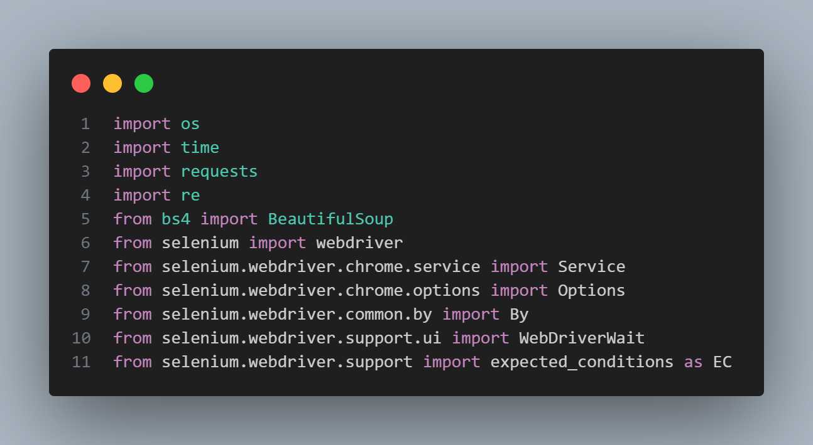

Para poder extraer información de la web, utilizamos varias librerías 📚 que nos ayudarán en diferentes tareas:

os → Nos permite interactuar con los archivos y carpetas de nuestro sistema.

time → Se usa para pausar el código y esperar antes de realizar ciertas acciones.

requests → Nos ayuda a hacer peticiones a sitios web y obtener su contenido.

re → Se usa para trabajar con patrones de texto, como encontrar enlaces o filtrar datos.
BeautifulSoup (de bs4) → Nos permite extraer información de una página web de forma más sencilla.

🚀 Automatización con Selenium

webdriver → Nos permite controlar un navegador web (como Chrome).

Service  → Maneja la configuración del navegador para Selenium.

Options → Nos ayuda a establecer preferencias para el navegador (como abrirlo en modo 
invisible).

By → Se usa para encontrar elementos dentro de la página web.

WebDriverWait → Permite que el código espere hasta que un elemento de la web aparezca.

expected_conditions (EC) → Nos ayuda a esperar hasta que ciertas condiciones se cumplan, como que un botón sea visible antes de hacer clic.

## 🔍 Estructura del Código  

Lo siguiente que mostraré es un poco cómo he **organizado** este código 📜.  

Voy a explicar **cada parte** para que sea fácil de entender y seguir 📌.  

---


## Clase IKEA Scraper

Esta clase se encarga de **extraer información** de la web de **IKEA** 🏠, específicamente imágenes de **armarios, mesas y sillas**.  

## 📌 1. Inicialización (`__init__` method)  
Cuando creamos un objeto de esta clase, se ejecuta este código automáticamente.  

###  `self.category_urls`  
- Es un diccionario que contiene las **categorías de muebles** y los enlaces de IKEA donde están los productos 📦.  
- Por ejemplo, para obtener **armarios**, el código buscará en:  
  - `"https://www.ikea.com/es/es/cat/armarios-19053/"`  

###  `self.headers`  
- Sirve para **simular** que el navegador es un usuario real y evitar bloqueos de la web.  
- Aquí se usa un **"User-Agent"** (que le dice a la web que estamos usando un navegador como Chrome o Firefox).  

---

## 2. Configuración del navegador con Selenium  
Como la web tiene **botones interactivos**, usamos **Selenium** para controlarla automáticamente.  

### `chrome_options = Options()`  
- Nos permite **configurar** cómo se abrirá el navegador.  
- `chrome_options.add_argument("--start-maximized")` 🖥️  
  - Abre el navegador en **pantalla completa** para evitar problemas con elementos ocultos.  

### `self.driver = webdriver.Chrome(...)`  
- Aquí estamos **iniciando Chrome** para que Selenium pueda interactuar con la web **como si fuera un usuario real**.  

---

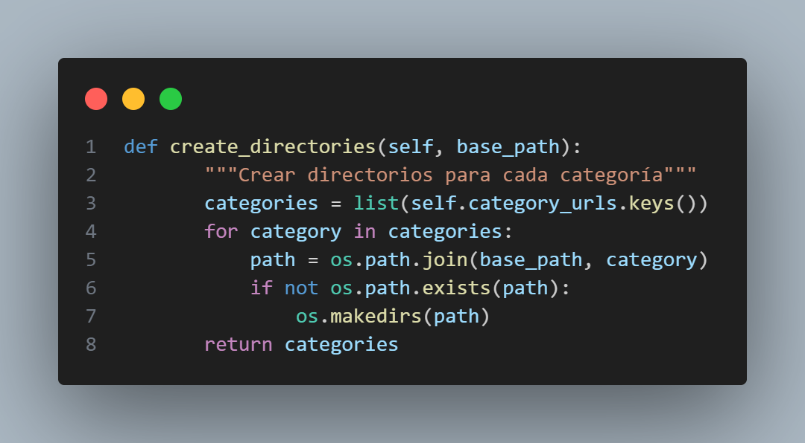

## Función `create_directories`

Esta función se encarga de **crear carpetas** en el sistema para almacenar las imágenes de cada categoría 🗂️.

### ¿Cómo funciona?

1. **Obtiene las categorías**  
   - Usa `self.category_urls.keys()` para obtener la lista de categorías disponibles (ejemplo: "sillas", "mesas", "armarios").  

2. **Crea una carpeta para cada categoría**  
   - Recorre la lista de categorías y construye la ruta donde se guardarán los datos.  
   - Usa `os.path.join(base_path, category)` para combinar la ruta base con el nombre de la categoría.  

3. **Verifica si la carpeta existe** 
   - Si la carpeta **no existe**, se crea con `os.makedirs(path)`.  

4. **Devuelve la lista de categorías**  
   - Retorna la lista de categorías que se crearon.  

--- 

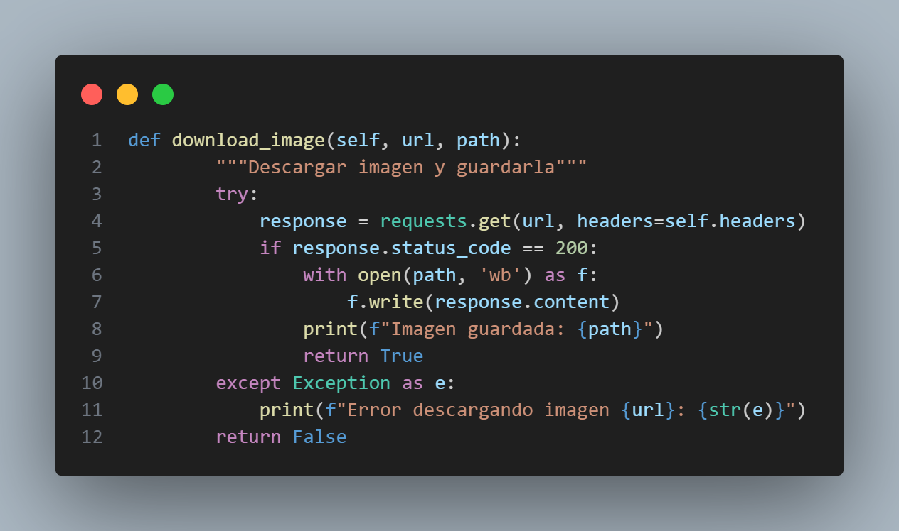 

## Función `download_image`

Esta función **descarga una imagen desde una URL y la guarda en el sistema** 📥📂.

### 🛠️ ¿Cómo funciona?

1. **Hace una solicitud a la URL** 
   - Utiliza `requests.get(url, headers=self.headers)` para obtener la imagen desde el enlace.  
   - Usa **`self.headers`** para simular una petición desde un navegador y evitar bloqueos.  

2. **Verifica que la imagen se haya descargado correctamente**   
   - Si el código de respuesta (`response.status_code`) es `200`, significa que la imagen se descargó sin problemas.  

3. **Guarda la imagen en el archivo especificado** 
   - Abre el archivo en modo escritura binaria (`'wb'`).  
   - Escribe el contenido de la imagen en el archivo.  
   - Imprime un mensaje confirmando que la imagen se guardó correctamente.  

4. **Manejo de errores** ⚠️  
   - Si ocurre un error en la descarga, se captura con `except Exception as e`.  
   - Se imprime un mensaje indicando el problema y la función devuelve `False`.  

---

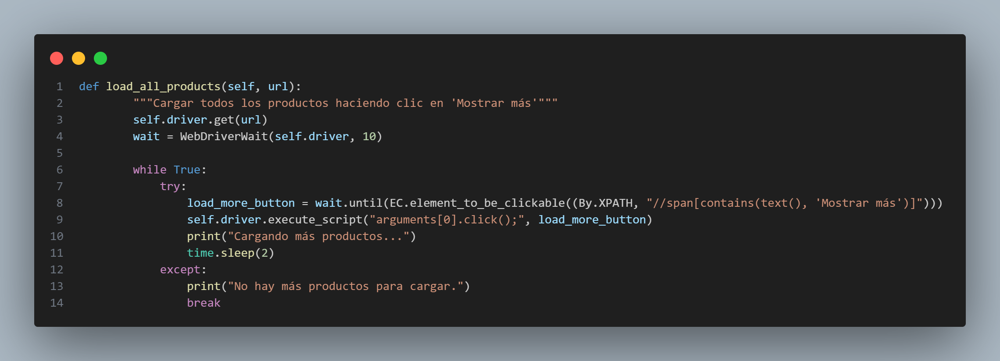 

## Función `load_all_products`

Esta función **carga todos los productos de la página web** haciendo clic en el botón `"Mostrar más"` hasta que ya no haya más productos disponibles .

### 🛠️ ¿Cómo funciona?

1. **Abre la página web** 
   - Utiliza `self.driver.get(url)` para acceder a la URL proporcionada.  

2. **Espera a que la página cargue**  
   - Crea una espera con `WebDriverWait` para asegurarse de que los elementos estén listos antes de interactuar con ellos.  

3. **Bucle para cargar más productos**   
   - Se usa un `while True` para hacer clic en `"Mostrar más"` varias veces.  
   - **Busca el botón** con `wait.until(...)` y verifica que sea **clickeable**.  
   - **Ejecuta un clic** en el botón con `execute_script("arguments[0].click();", load_more_button)`.  
   - Muestra el mensaje `"Cargando más productos..."` en la terminal.  
   - Espera `2 segundos` (`time.sleep(2)`) antes de intentar hacer clic nuevamente.  

4. **Manejo de errores** 
   - Si el botón `"Mostrar más"` ya no está disponible, significa que **no hay más productos**.  
   - En ese caso, se muestra el mensaje `"No hay más productos para cargar."` y el bucle se detiene con `break`.

---

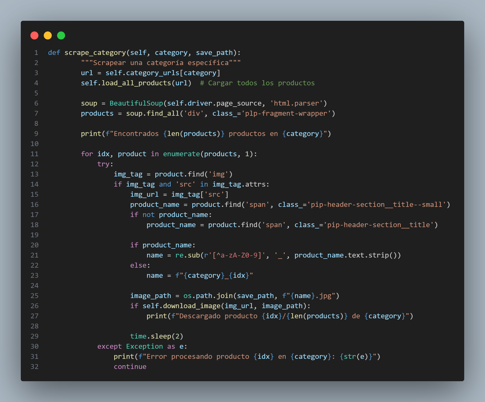 

## Función `scrape_category`

Esta función **extrae imágenes de productos** de una **categoría específica** en IKEA y las guarda en una carpeta .

### 🛠️ ¿Cómo funciona?

1. **Carga la página de la categoría** 
   - Obtiene la URL de la categoría desde `self.category_urls[category]`.  
   - Llama a `self.load_all_products(url)`, que se encarga de hacer clic en `"Mostrar más"` hasta que todos los productos estén cargados.  

2. **Extrae los productos con `BeautifulSoup`**  
   - Obtiene el código HTML de la página con `self.driver.page_source`.  
   - Busca todos los productos en la web usando `soup.find_all('div', class_='plp-fragment-wrapper')`.  

3. **Recorre cada producto y extrae su información**  
   - Para cada producto, intenta encontrar:  
     - La **imagen** (``) y su URL.  
     - El **nombre del producto** dentro de un `<span>`.  

4. **Limpia el nombre del producto** 
   - Si el nombre contiene caracteres especiales, los reemplaza con `_` usando `re.sub()`.  
   - Si no se encuentra un nombre, usa un nombre genérico basado en la categoría y el índice (`category_idx`).  

5. **Descarga la imagen**
   - Guarda la imagen en la ruta `save_path`, nombrándola con el nombre limpio.  
   - Llama a `self.download_image(img_url, image_path)`, que descarga y guarda la imagen.  
   - Muestra un mensaje en la terminal confirmando la descarga.  

6. **Manejo de errores**   
   - Si hay un problema al procesar un producto, muestra un mensaje de error y pasa al siguiente.  

---

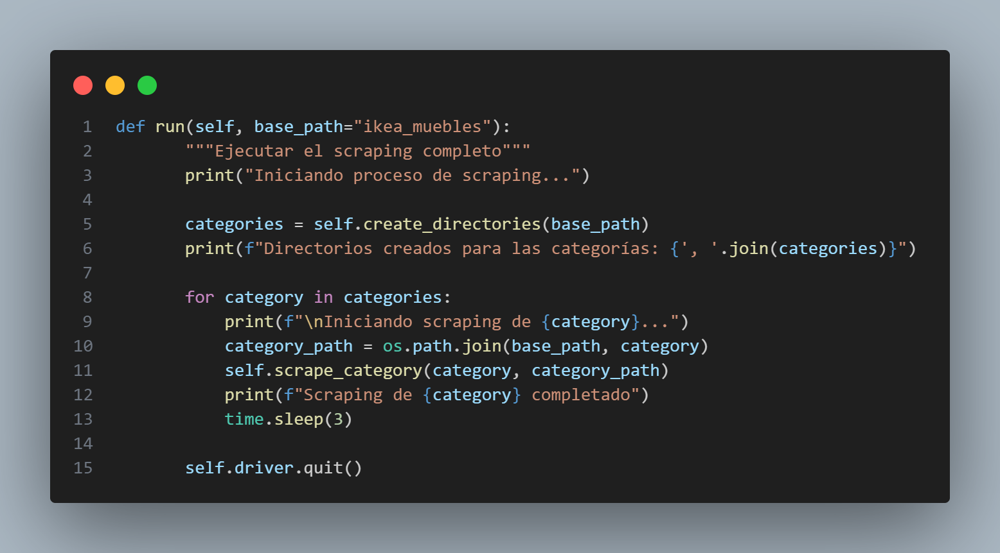 

## Función `run`

Esta función **ejecuta el scraping completo** en todas las categorías definidas.

### 🛠️ ¿Cómo funciona?

1. **Muestra un mensaje de inicio**  
   - Se imprime `"Iniciando proceso de scraping..."` para indicar que el proceso ha comenzado.  

2. **Crea los directorios para cada categoría**   
   - Llama a `self.create_directories(base_path)`, que se encarga de crear carpetas donde se guardarán las imágenes.  
   - Muestra en la terminal las categorías para las cuales se han creado carpetas.  

3. **Realiza el scraping de cada categoría**   
   - **Recorre todas las categorías disponibles** usando un `for`.  
   - **Imprime un mensaje indicando que está iniciando el scraping** de esa categoría.  
   - Genera la ruta donde se guardarán las imágenes (`category_path`).  
   - Llama a `self.scrape_category(category, category_path)`, que extrae las imágenes de la web.  
   - Muestra un mensaje indicando que el scraping de esa categoría ha finalizado.  
   - **Espera 3 segundos (`time.sleep(3)`)** antes de pasar a la siguiente categoría.  

4. **Cierra el navegador** 
   - Llama a `self.driver.quit()`, lo que finaliza el uso de Selenium y cierra el navegador.  

--- 

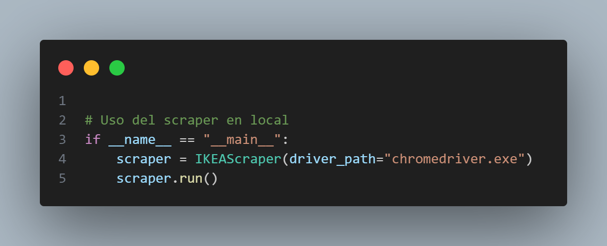 

## Ejecución del scraper en local

Este bloque de código **inicia el proceso de scraping** cuando ejecutamos el script en nuestro ordenador.

### 🛠️ ¿Cómo funciona?

1. **Verifica si el script se está ejecutando directamente** 
   - La condición `if __name__ == "__main__":` se asegura de que el código **solo se ejecute** cuando ejecutamos el archivo directamente y no si se importa como módulo en otro script.  

2. **Crea una instancia del scraper** 
   - Se inicializa un objeto `IKEAScraper`, indicando la ruta del **ChromeDriver** (`chromedriver.exe`).  
   - `ChromeDriver` es necesario para que **Selenium** pueda controlar el navegador.  

3. **Ejecuta el proceso completo de scraping**  
   - Se llama a `scraper.run()`, que se encargará de:
     - Abrir el navegador.
     - Extraer los productos de todas las categorías.
     - Descargar las imágenes.
     - Guardarlas en carpetas organizadas.

---

## Ampliando el scraping: objetos más pequeños  

Después de extraer información sobre **muebles**, decidimos también obtener datos de **objetos más pequeños** que se pueden encontrar dentro de la empresa, como **teclados, portátiles y ratones** ⌨️💻🖱️.  

### Cambio de fuente: PCComponentes  
Para estos productos, optamos por **extraer la información de PCComponentes**.  

Sin embargo, pronto nos dimos cuenta de una **diferencia clave** con la web de IKEA:  
🔹 **No tenía un botón de "Cargar más"** como IKEA.  
🔹 En su lugar, había un **botón para pasar a la siguiente página**.  

### 🚧 Problema encontrado: Bloqueo de bots  
Cuando intentamos **pasar a la siguiente página**, la web nos detectaba como **un bot** 🚫🤖, impidiendo que siguiéramos navegando.  

### Solución ingeniosa  
Para **evitar el bloqueo**, encontramos una solución **sencilla pero efectiva**:  

En lugar de hacer clic en **"Siguiente página"**, usamos un **bucle** que:  
1. **Scrapea** la información de la página actual.  
2. **Cierra el navegador** completamente.  
3. **Vuelve a abrirlo** en la siguiente página con la nueva URL.  

📌 **Resultado:** La web no detectaba que éramos un bot, permitiéndonos extraer la información sin problemas 🎯.  

---

## Código para extraer datos de PCComponentes  

En esta situación, utilizaremos **tres códigos similares** , pero con algunos **detalles específicos** cambiados para que cada uno **interactúe con su categoría correspondiente**.  

📌 **Las tres categorías a scrapear son:**  
- **Teclados** 
- **Portátiles**  
- **Ratones**   

Dado que los códigos son casi **idénticos**, solo mostraré el código correspondiente a **los ratones**, ya que la lógica es la misma para los otros dos casos, con pequeños ajustes.  

---

📌 **A continuación, el código para extraer información de los ratones en PCComponentes**.

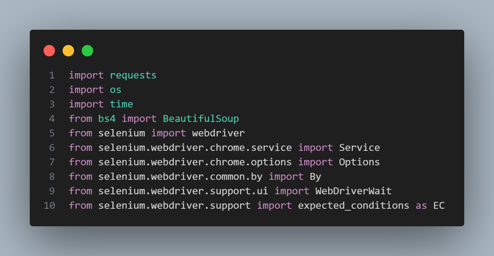 

##  Librerías utilizadas para el scraping de PCComponentes  

Para poder extraer los datos de **PCComponentes**, utilizamos varias **librerías** que nos ayudarán en diferentes tareas:  

### 🔹 **Librerías básicas**
- **`requests`** → Se usa para hacer peticiones a la web y obtener su contenido.  
- **`os`** → Permite interactuar con los archivos y carpetas del sistema.  
- **`time`** → Se usa para hacer pausas en el código y evitar bloqueos por sobrecarga de peticiones.  

### **BeautifulSoup: Análisis del HTML**
- **`BeautifulSoup (bs4)`** → Se encarga de **extraer información del código HTML** de la web.  

### **Selenium: Automatización del navegador**  
Dado que la web de **PCComponentes** requiere **interacción con la paginación**, usamos **Selenium** para controlarla:  

- **`webdriver`** → Controla el navegador (Chrome en este caso).  
- **`Service`** → Configura la ejecución del navegador de forma automática.  
- **`Options`** → Permite configurar cómo se abre el navegador (ejemplo: en modo sin interfaz).  
- **`By`** → Se usa para buscar elementos dentro de la web (ejemplo: botones o imágenes).  
- **`WebDriverWait`** → Permite que el código **espere** hasta que un elemento de la web se cargue correctamente.  
- **`expected_conditions (EC)`** → Se usa para definir condiciones antes de interactuar con elementos de la web (como esperar a que un botón sea clickeable).  

---

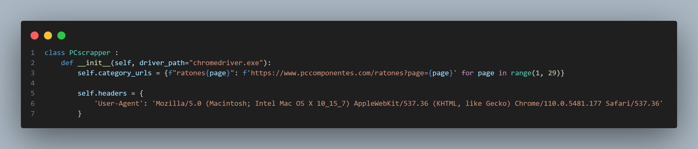  

## Clase `PCscrapper`

Esta clase se encarga de **extraer información de los ratones en PCComponentes**.  

### 🛠️ **Inicialización de la clase (`__init__` method)**  

Cuando creamos un objeto de esta clase, se ejecuta el código de inicialización que:  

### **Define las URLs de las páginas a scrapear**  
- **`self.category_urls`** almacena un **diccionario de URLs**, donde cada clave es el nombre de la página y el valor es la URL correspondiente.  
- Se usa un **bucle con `range(1, 29)`**, lo que indica que se van a recorrer **28 páginas** (de la 1 a la 28).  
- La URL cambia dinámicamente con `?page={page}`, lo que permite navegar por las diferentes páginas sin hacer clic en "Siguiente".  

### **Define las cabeceras (`headers`)**  
- **`self.headers`** almacena un **"User-Agent"**, que hace que la petición parezca de un navegador real.  
- Esto ayuda a **evitar bloqueos** por parte de la web al detectar actividad sospechosa de bots 🤖🚫.  

---

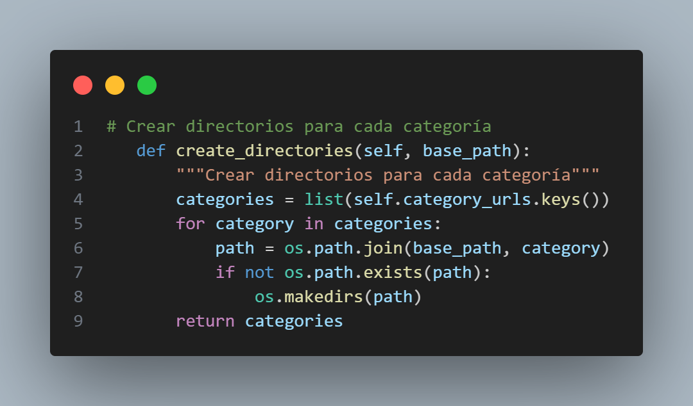 

## Función `create_directories`

Esta función se encarga de **crear carpetas** en el sistema para almacenar las imágenes de cada categoría .

### 🛠️ ¿Cómo funciona?

1. **Obtiene las categorías** 
   - Usa `self.category_urls.keys()` para obtener la lista de categorías disponibles (ejemplo: `"ratones1"`, `"ratones2"`, `"ratones3"`, etc.).  

2. **Crea una carpeta para cada categoría**  
   - Recorre la lista de categorías y **construye la ruta** donde se guardarán los datos.  
   - Usa `os.path.join(base_path, category)` para combinar la ruta base con el nombre de la categoría.  

3. **Verifica si la carpeta existe** 
   - Si la carpeta **no existe**, se crea con `os.makedirs(path)`.  

4. **Devuelve la lista de categorías** 
   - Retorna la lista de categorías que se crearon.  

---

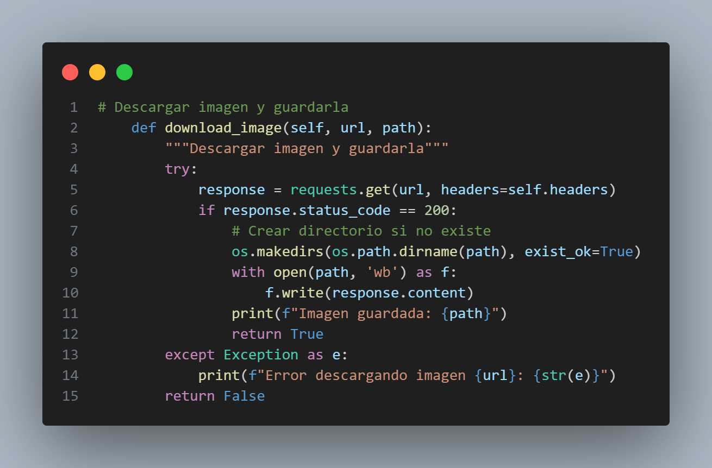 

## Función `download_image`

Esta función **descarga una imagen desde una URL y la guarda en el sistema**.

### 🛠️ **¿Cómo funciona?**

1. **Hace una solicitud a la URL** 
   - Usa `requests.get(url, headers=self.headers)` para obtener la imagen desde el enlace.  
   - Incluye **cabeceras HTTP (`headers`)** para **simular una petición real de un navegador** y evitar bloqueos.  

2. **Verifica que la imagen se haya descargado correctamente**  
   - Si el código de respuesta (`response.status_code`) es **200**, significa que la imagen se descargó sin problemas.  

3. **Crea el directorio si no existe** 
   - Usa `os.makedirs(os.path.dirname(path), exist_ok=True)` para asegurarse de que la carpeta donde se guardará la imagen **exista**.  
   - `exist_ok=True` evita errores si la carpeta ya está creada.  

4. **Guarda la imagen en el archivo especificado**  
   - Abre el archivo en modo escritura binaria (`'wb'`).  
   - Escribe el contenido de la imagen en el archivo.  
   - Imprime un mensaje confirmando que la imagen se guardó correctamente.  

5. **Manejo de errores** 
   - Si ocurre un error en la descarga, se captura con `except Exception as e`.  
   - Se imprime un mensaje indicando el problema y la función devuelve `False`.  

---

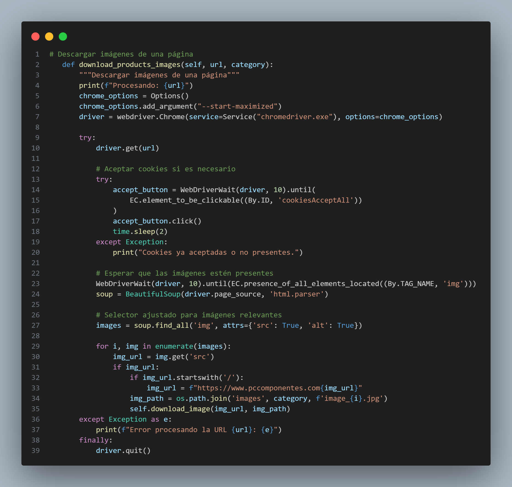 

## Función `download_products_images`

Esta función **descarga imágenes de una página web de manera automática**.

### 🛠️ **¿Cómo funciona?**

1. **Abre la página web en Chrome** 
   - Usa **Selenium** para abrir la URL en un navegador.  
   - Configura el navegador en **modo maximizado** para evitar problemas de visualización.  

2. **Acepta las cookies si es necesario**  
   - Busca el botón de "Aceptar cookies" y hace clic en él.  
   - Si el botón no está presente, **el código sigue sin problemas**.  

3. **Espera a que las imágenes se carguen**  
   - Usa `WebDriverWait` para asegurarse de que las imágenes estén visibles antes de continuar.  
   - Utiliza **BeautifulSoup** para analizar el código HTML de la página y extraer las imágenes.  

4. **Busca y filtra imágenes relevantes**   
   - Extrae todas las etiquetas `` que tengan atributos `src` (enlace de imagen) y `alt` (descripción).  
   - Obtiene la URL de cada imagen.  
   - Si la URL es **relativa** (empieza con `/`), se convierte en una URL **completa** agregando el dominio.  

5. **Descarga y guarda las imágenes**  
   - Genera un **nombre de archivo único** (`image_{i}.jpg`) y lo guarda en una carpeta según su categoría.  
   - Llama a la función `self.download_image()` para almacenar la imagen correctamente.  

6. **Manejo de errores y cierre del navegador**   
   - Si hay un error durante la ejecución, se muestra un mensaje con la URL afectada.  
   - Al final, **siempre se cierra el navegador** para liberar recursos.  

---

   

## Función `run`

Esta función **ejecuta el scraper** y se encarga de **organizar y descargar las imágenes** de diferentes categorías.

### 🛠️ **¿Cómo funciona?**

1. **Define la carpeta base donde se guardarán las imágenes**   
   - `base_path = 'images'` establece el directorio principal donde se almacenarán las imágenes descargadas.  

2. **Crea las carpetas necesarias** 
   - Usa `self.create_directories(base_path)` para asegurarse de que la carpeta base **exista antes de guardar las imágenes**.  
   - Si la carpeta ya existe, **evita errores y continúa con la ejecución**.  

3. **Recorre todas las categorías de productos**   
   - Usa un **bucle `for`** para iterar sobre `self.category_urls.items()`, donde cada categoría tiene una URL específica.  
   - Extrae la `category` (nombre de la categoría) y `url` (dirección web donde se encuentran las imágenes).  

4. **Llama a la función de descarga de imágenes**  
   - `self.download_products_images(url, category)` procesa la página y **descarga las imágenes correspondientes a cada categoría**.  

---

  

## Bloque `if __name__ == "__main__"`

Este bloque de código **ejecuta el programa en local** y **pone en marcha el scraper**.

### 🛠️ **¿Cómo funciona?**

1. **Verifica que el script se está ejecutando directamente** 
   - La línea `if __name__ == '__main__':` **asegura que el código solo se ejecute si este archivo es ejecutado directamente**, y **no si es importado como módulo en otro script**.  

2. **Crea una instancia del scraper** 
   - `scrapper = PCscrapper()` inicializa un objeto de la clase `PCscrapper`, que contiene toda la lógica del scraping.  
   - Aquí se configuran las opciones y los parámetros del scraper.  

3. **Ejecuta el scraper** 
   - `scrapper.run()` llama a la función `run()` para iniciar la **descarga y organización de imágenes** desde las páginas web.  
   - Esto hace que **se ejecuten todos los procesos del scraper automáticamente**.  

---

# 🖥️ **Scraping de datos de ratones en PCComponentes para Power BI** 📊  

Para la **visualización de datos en Power BI**, pensé que ya tenía las imágenes, así que… **¿qué tan difícil podría ser obtener los datos de los ratones ?** 

Bueno, resultó ser **el mayor reto al que me he enfrentado**.  

### **El desafío**  
Por más que intentaba localizar los datos, **cambiaba el nombre de las class una y otra vez**, pero nada funcionaba. Cuando estaba **a punto de rendirme**, tomé aire, suspiré y decidí empezar **desde cero, paso a paso**.  

### **Paso a paso, desentrañando los datos**  
1️⃣ **Extraer el nombre**: Fue lo más fácil, así que comencé por ahí.   
2️⃣ **Obtener el precio**: Perfecto, ahora tenía **2 de los 5 datos** que necesitaba.   
3️⃣ **Conseguir la URL**: Tras algunos intentos, me di cuenta de que todas las URLs seguían el mismo patrón:  
   **Dominio de la web + Nombre del producto** 🌐🔗  
   ¡Un descubrimiento clave! De repente, **todas las URLs estaban listas**.  
4️⃣ **Valoraciones y cantidad de opiniones**: Ahora que entendía la estructura, estos datos vinieron **de inmediato**.  

### 🔄 **El problema de la paginación**  
Cuando intenté pasar a la **siguiente página**, **el navegador no respondía correctamente**.  
Así que decidí **cerrarlo y abrirlo en cada nueva página**. ¡Funcionó! Ahora tenía **27 archivos CSV**, uno por cada página de productos. 

### 🏆 **Lo que aprendí**  
✅ A veces, lo mejor es **empezar desde cero y avanzar poco a poco**.  
✅ **Observar patrones** en los datos puede hacerte la vida más fácil.  
✅ **Cada problema tiene una solución** (aunque implique reiniciar el navegador 🔄).  

Próximo paso: **unir los 27 CSV en un solo archivo** y prepararlo para **Power BI**.  

---

## Código para la obtención de datos. 

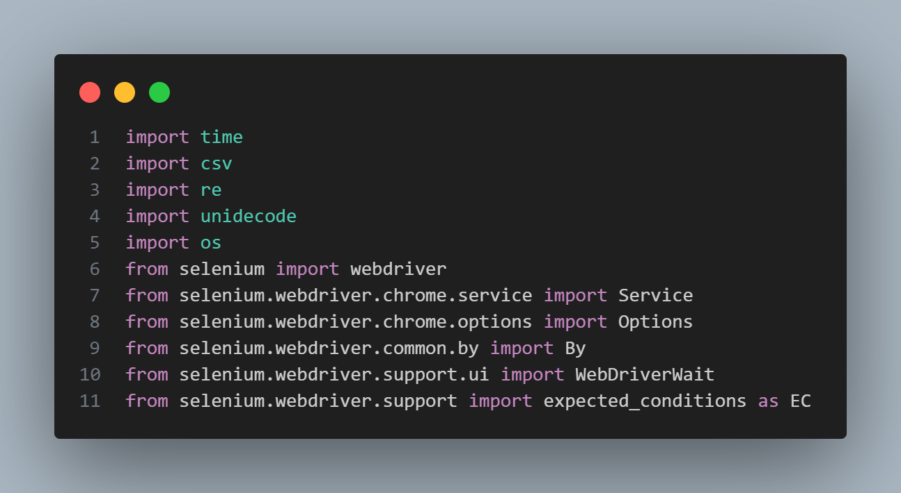  

## 📦 **Módulos importados en el scraper**  

Este bloque de código **importa todas las librerías necesarias** para el funcionamiento del scraper.   

### 🛠️ **¿Para qué sirve cada una?**  

#### **Manejo del tiempo**  
- `import time` → Permite **pausar la ejecución** del código en momentos clave.  

#### **Manejo de archivos CSV y texto**  
- `import csv` → Para **guardar los datos extraídos** en archivos CSV.  
- `import re` → **Expresiones regulares**, útil para limpiar y estructurar texto.  
- `import unidecode` → **Elimina acentos y caracteres especiales**, útil para URLs.  

#### **Manejo del sistema de archivos**  
- `import os` → Permite **crear directorios y manejar rutas de archivos**.  

#### **Automatización del navegador con Selenium**  
- `from selenium import webdriver` → Para **controlar el navegador web**.  
- `from selenium.webdriver.chrome.service import Service` → Gestiona **el servicio de ChromeDriver**.  
- `from selenium.webdriver.chrome.options import Options` → Configura **opciones avanzadas del navegador**.  
- `from selenium.webdriver.common.by import By` → Facilita **la búsqueda de elementos en la web**.  
- `from selenium.webdriver.support.ui import WebDriverWait` → Permite **esperar a que aparezcan elementos en la página**.  
- `from selenium.webdriver.support import expected_conditions as EC` → Define **condiciones específicas para esperar elementos** (ejemplo: "cuando un botón sea clickeable").  

---

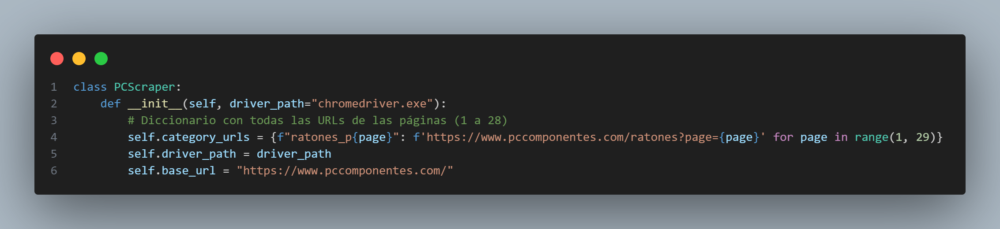  

##  **Clase `PCScraper`**

Esta clase define el **scraper** encargado de extraer información de ratones en **PCComponentes**

### 🛠️ **¿Cómo funciona?**

1. **Define el `chromedriver.exe` como controlador del navegador** 🏎
   - El parámetro `driver_path="chromedriver.exe"` establece **la ruta del driver de Chrome** para automatizar la navegación.  
   - Esto permite que Selenium **controle el navegador y acceda a las páginas de productos**.  

2. **Genera un diccionario con todas las URLs de las páginas** 
   - `self.category_urls` almacena un diccionario donde:  
     - La **clave** es el identificador de la página (`ratones_p1`, `ratones_p2`, etc.).  
     - El **valor** es la **URL completa** de cada página de productos.  
   - Usa **un bucle con `range(1, 29)`**, generando automáticamente **las 28 páginas** de resultados.  

3. **Guarda la ruta del controlador y la URL base** 
   - `self.driver_path = driver_path` almacena la ubicación del **ChromeDriver**.  
   - `self.base_url = "https://www.pccomponentes.com/"` establece la **URL base de la tienda**.  

---

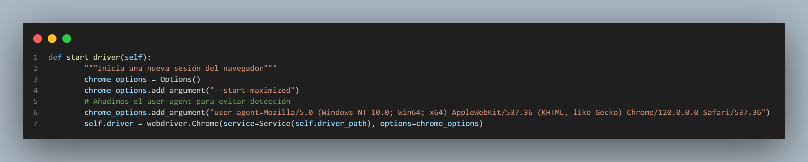  

## **Función `start_driver`**

Esta función **inicia una nueva sesión del navegador Chrome** con configuraciones personalizadas para **optimizar el scraping** y **evitar bloqueos**. 

### 🛠️ **¿Cómo funciona?**  

1️⃣ **Crea una configuración especial para el navegador** 
   - `chrome_options = Options()` inicializa un objeto para **definir opciones avanzadas de Chrome**.  
   - `chrome_options.add_argument("--start-maximized")` hace que el navegador **se inicie en pantalla completa**, lo que **reduce errores de carga y mejora la visibilidad de los elementos**.  

2️⃣ **Evita la detección como bot** 
   - `chrome_options.add_argument("user-agent=Mozilla/...")` cambia el **User-Agent** del navegador.  
   - Simula que la petición proviene de un usuario real en lugar de un bot, lo que **disminuye la probabilidad de ser bloqueado** por la web.  

3️⃣ **Inicia el navegador con la configuración establecida**  
   - `self.driver = webdriver.Chrome(service=Service(self.driver_path), options=chrome_options)`  
   - **Se usa `Service(self.driver_path)`** para asegurarse de que el controlador **ChromeDriver** funcione correctamente.  
   - Todas las opciones configuradas se aplican para garantizar **una navegación fluida y sin detección**.  

---

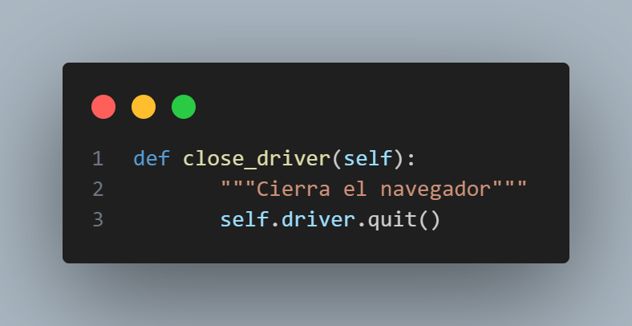  

## **Función `close_driver`**  

Esta función **cierra el navegador** una vez que el scraping ha terminado, asegurando que los recursos del sistema se liberen correctamente. 

### 🛠️ **¿Cómo funciona?**  

1️⃣ **Cierra la sesión del navegador** 
   - `self.driver.quit()` **cierra completamente la ventana de Chrome**, finalizando la sesión de Selenium.  
   - Esto **libera memoria y evita que queden procesos abiertos** innecesariamente.  

---
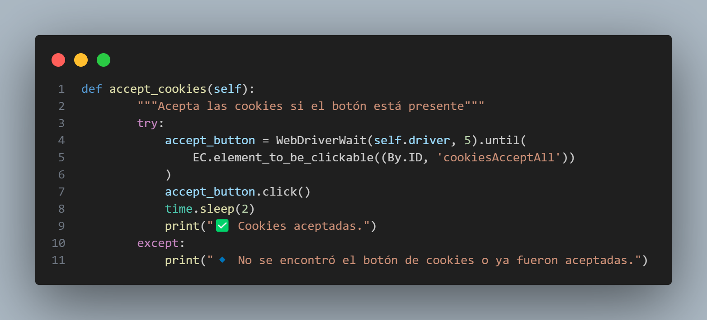  

## **Función `accept_cookies`**  

Esta función **acepta las cookies automáticamente** si el botón está presente en la página, evitando interrupciones durante el scraping.

### 🛠️ **¿Cómo funciona?**  

1️⃣ **Espera a que el botón de aceptar cookies esté disponible** 
   - Usa `WebDriverWait(self.driver, 5).until(EC.element_to_be_clickable((By.ID, 'cookiesAcceptAll')))` para **esperar hasta 5 segundos** a que el botón sea clickeable.  

2️⃣ **Hace clic en el botón de aceptación** 
   - Si el botón se encuentra, `accept_button.click()` lo presiona automáticamente.  
   - `time.sleep(2)` agrega una pequeña pausa de **2 segundos** para asegurar que el clic se registre correctamente.  

3️⃣ **Manejo de errores** 
   - Si el botón **no aparece o las cookies ya fueron aceptadas**, **se captura la excepción**.  
   - Muestra el mensaje `"🔹 No se encontró el botón de cookies o ya fueron aceptadas."`, permitiendo que el código **siga ejecutándose sin problemas**.  

---

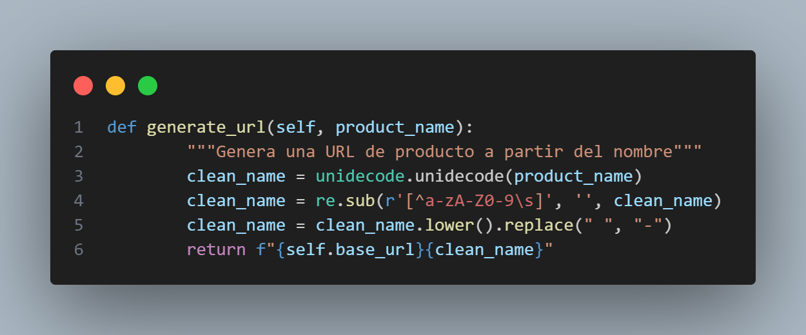  

## **Función `generate_url`**  

Esta función **genera una URL válida** para un producto a partir de su nombre, asegurándose de que tenga el formato adecuado para ser usada en la web. 

### 🛠️ **¿Cómo funciona?**  

1️⃣ **Elimina caracteres especiales y acentos** 
   - `unidecode.unidecode(product_name)` convierte caracteres con acentos (ej. `Cámara`) a su equivalente sin acento (`Camara`).  
   - Esto **garantiza compatibilidad con URLs**, evitando caracteres inválidos.  

2️⃣ **Filtra caracteres no deseados** 
   - `re.sub(r'[^a-zA-Z0-9\s]', '', clean_name)` elimina **todo lo que no sea letras, números o espacios**.  
   - Así se evita que caracteres especiales rompan la URL.  

3️⃣ **Convierte el texto a minúsculas y reemplaza espacios**   
   - `clean_name.lower()` transforma el texto a **minúsculas** para mantener consistencia.  
   - `.replace(" ", "-")` reemplaza los espacios por guiones (`-`), que son estándar en URLs.  

4️⃣ **Genera la URL final** 
   - `return f"{self.base_url}{clean_name}"` une la **URL base** con el nombre limpio del producto.  
   - Por ejemplo, si `product_name = "Ratón Óptico Gamer"`, la salida será:  
     ```
     https://www.pccomponentes.com/raton-optico-gamer
     ```  
--- 


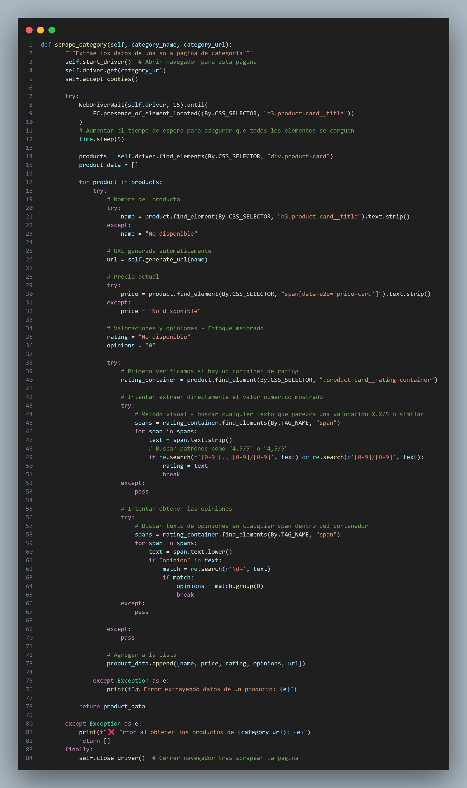  

## **Función `scrape_category`**  

Esta función **extrae los datos de una sola página de una categoría específica** dentro de la tienda online. 

### 🛠️ **¿Cómo funciona?**  

1️⃣ **Inicia el navegador** 
   - `self.start_driver()` abre una nueva ventana de Chrome para realizar el scraping.  
   - Se asegura de que el navegador **esté configurado correctamente** antes de comenzar.  

2️⃣ **Carga la página de la categoría**  
   - `self.driver.get(category_url)` accede a la URL de la categoría que se quiere analizar.  
   - Aquí es donde estarán **todos los productos de esa categoría**.  

3️⃣ **Acepta las cookies si es necesario**  
   - `self.accept_cookies()` busca y **hace clic en el botón de aceptar cookies** si aparece.  
   - Evita que este aviso bloquee la ejecución del scraper.  

### **Esperando la carga de productos en `scrape_category`**  

Esta parte de la función **espera a que los productos de la categoría se carguen completamente** antes de extraerlos. 

### 🛠️ **¿Cómo funciona?**  

1️⃣ **Espera a que aparezcan los productos** ⏳  
   - `WebDriverWait(self.driver, 15).until(EC.presence_of_element_located(...))`  
   - **Se espera hasta 15 segundos** para que al menos un producto cargue correctamente.  
   - Busca un `h3.product-card__title`, que es el **título del producto** en la página.  

2️⃣ **Añade una pausa extra** 
   - `time.sleep(5)` da **5 segundos adicionales** para asegurarse de que **todos los elementos de la página estén listos**.  
   - Esto ayuda a evitar errores si el contenido se carga lentamente.  

3️⃣ **Extrae la lista de productos** 
   - `products = self.driver.find_elements(By.CSS_SELECTOR, "div.product-card")`  
   - Encuentra **todos los productos** en la página, cada uno dentro de un `div.product-card`.  
   - Guarda estos elementos en la lista `products`.  

4️⃣ **Prepara la lista de datos**  
   - `product_data = []` crea una lista vacía donde **se guardará la información de cada producto**.  
   - En los siguientes pasos, se extraerán detalles como **nombre, precio, valoraciones, etc.** y se guardarán aquí.  

### **Extracción de datos de los productos**  

Esta parte de la función **recorre todos los productos de la categoría** y extrae información clave como el **nombre, URL y precio**. 🏷️💰  

### 🛠️ **¿Cómo funciona?**  

1️⃣ **Recorre todos los productos encontrados**   
   - `for product in products:` itera sobre **cada producto en la lista `products`**.  
   - Cada **`product`** representa un artículo en la página.  

2️⃣ **Extrae el nombre del producto** 
   - `name = product.find_element(By.CSS_SELECTOR, "h3.product-card__title").text.strip()`  
   - Busca el **título del producto** dentro de la tarjeta (`product-card`).  
   - Usa `.strip()` para **eliminar espacios extra** antes y después del texto.  
   - Si el título **no está disponible**, asigna `"No disponible"`.  

3️⃣ **Genera la URL del producto automáticamente**  
   - `url = self.generate_url(name)`  
   - Llama a la función `generate_url(name)` para **crear una URL válida basada en el nombre**.  
   - Reemplaza espacios y caracteres especiales para que la URL sea compatible con la web.  

4️⃣ **Extrae el precio del producto** 
   - `price = product.find_element(By.CSS_SELECTOR, "span[data-e2e='price-card']").text.strip()`  
   - Busca el precio dentro de un `span` con el atributo `data-e2e='price-card'`.  
   - Si el precio **no está disponible**, asigna `"No disponible"`. 

### ⭐ **Extracción de Valoraciones y Opiniones**  

Esta parte de la función **extrae la valoración (rating) y el número de opiniones** de cada producto, asegurándose de que la información se capture correctamente. 

### 🛠️ **¿Cómo funciona?**  

1️⃣ **Inicializa valores predeterminados** 
   - `rating = "No disponible"` y `opinions = "0"` aseguran que si no se encuentra información, **no haya valores vacíos**.  

2️⃣ **Verifica si el producto tiene valoraciones**  
   - `rating_container = product.find_element(By.CSS_SELECTOR, ".product-card__rating-container")`  
   - Busca el **contenedor de valoraciones** dentro de la tarjeta del producto.  
   - Si no existe, el código **continúa sin errores**.  

3️⃣ **Extrae la valoración numérica del producto**   
   - Se buscan `span` dentro del `rating_container`.  
   - Se analiza cada `span.text` para detectar patrones como `4.5/5` o `4,5/5`.  
   - Usa `re.search(r'[0-9][.,][0-9]/[0-9]', text)` para identificar formatos válidos.  
   - Si se encuentra, se guarda en `rating` y se detiene la búsqueda.  

4️⃣ **Extrae el número de opiniones** 
   - Busca palabras clave como `"opinión"` dentro del contenedor de valoraciones.  
   - Extrae el primer número encontrado (`\d+`) y lo asigna a `opinions`.  
   - Si no hay opiniones visibles, el valor **permanece en "0"**.  

5️⃣ **Manejo de errores** 
   - Si el contenedor de valoraciones **no existe**, el código **sigue sin fallar**.  
   - Se usa `try-except` en varios niveles para **evitar que errores en una parte bloqueen la ejecución completa**.  

### **Almacenamiento de Datos y Manejo de Errores**  

Esta última parte de la función **guarda los datos extraídos en una lista y maneja posibles errores**, asegurando que el scraping se complete correctamente. 

### 🛠️ **¿Cómo funciona?**  

1️⃣ **Guarda los datos en una lista** 
   - `product_data.append([name, price, rating, opinions, url])`  
   - **Cada producto** se almacena como una lista con los siguientes valores:  
     - 📌 `name` → Nombre del producto.  
     - 💲 `price` → Precio actual.  
     - ⭐ `rating` → Valoración promedio.  
     - 💬 `opinions` → Número de opiniones.  
     - 🔗 `url` → Enlace al producto.  
   - Esto permite que todos los datos queden organizados y listos para su uso posterior (ej. guardado en CSV o base de datos).  

2️⃣ **Manejo de errores en productos individuales**   
   - `except Exception as e:` captura cualquier **error durante la extracción de un producto**.  
   - Si un producto falla, muestra el mensaje `⚠ Error extrayendo datos de un producto: {e}`.  
   - **El resto de los productos se siguen procesando sin interrupciones**.  

3️⃣ **Devuelve la lista de productos extraídos**   
   - `return product_data` devuelve **todos los datos recopilados** en la categoría actual.  
   - Si no se encuentran productos, se devuelve una **lista vacía** `[]`.  

4️⃣ **Manejo de errores en toda la categoría**   
   - Si hay un error **en toda la página**, lo captura `except Exception as e:`.  
   - Muestra `❌ Error al obtener los productos de {category_url}: {e}` para indicar qué falló.  
   - En este caso, también devuelve `[]`, asegurando que el scraper no se detenga completamente.  

5️⃣ **Cierra el navegador al finalizar**   
   - `finally: self.close_driver()`  
   - **Se cierra el navegador en todos los casos**, ya sea que la extracción haya sido exitosa o haya ocurrido un error.  
   - Esto evita **consumo innecesario de recursos** y posibles bloqueos en futuras ejecuciones.  

---

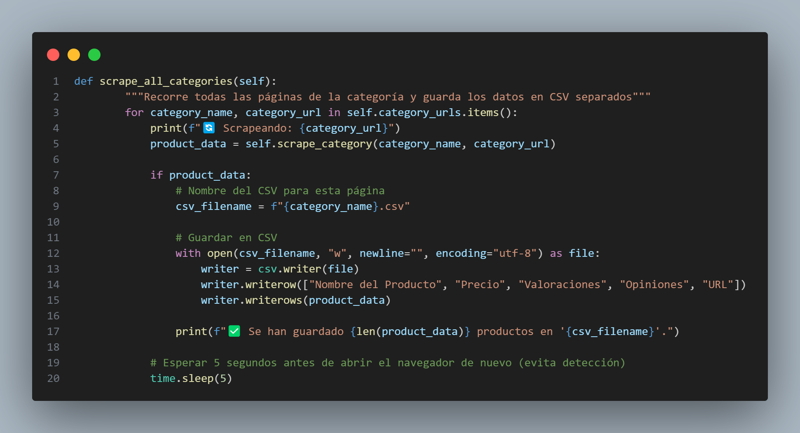  

### 📂 **Función `scrape_all_categories`**  

Esta función **recorre todas las páginas de productos de la categoría y guarda los datos en archivos CSV separados**. 

### 🛠️ **¿Cómo funciona?**  

1️⃣ **Recorre todas las categorías disponibles** 
   - `for category_name, category_url in self.category_urls.items():`  
   - Itera sobre el **diccionario `self.category_urls`**, que contiene los nombres y URLs de cada categoría.  

2️⃣ **Llama a la función `scrape_category` para extraer los productos**  
   - `product_data = self.scrape_category(category_name, category_url)`  
   - Llama a la función `scrape_category` para **extraer los productos de la página actual**.  
   - Si la categoría **tiene productos**, se procede a guardarlos.  

3️⃣ **Guarda los datos en un archivo CSV** 
   - **Genera un nombre de archivo** basado en la categoría:  
     ```python
     csv_filename = f"{category_name}.csv"
     ```
   - **Abre el archivo CSV en modo escritura (`"w"`)**, asegurando que se cree desde cero.  
   - **Escribe los encabezados** en la primera fila:  
     - 📌 `Nombre del Producto`  
     - 💲 `Precio`  
     - ⭐ `Valoraciones`  
     - 💬 `Opiniones`  
     - 🔗 `URL`  
   - **Escribe los datos de los productos** fila por fila con `writer.writerows(product_data)`.  

4️⃣ **Muestra un mensaje de éxito**  
   - Indica cuántos productos se han guardado y en qué archivo CSV.  
   - Ejemplo de salida:  
     ```
     ✅ Se han guardado 50 productos en 'ratones_p1.csv'.
     ```

5️⃣ **Espera 5 segundos antes de continuar con la siguiente página** 
   - `time.sleep(5)`  
   - **Evita que el scraper sea detectado como bot**, simulando un comportamiento humano.  

---


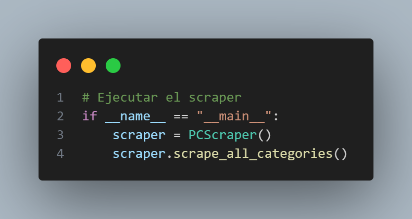  


## **Ejecución del Scraper**  

Este bloque de código **pone en marcha el scraper**, iniciando el proceso de extracción de datos de todas las categorías. 

### 🛠️ **¿Cómo funciona?**  

1️⃣ **Verifica que el script se está ejecutando directamente**  
   - `if __name__ == "__main__":`  
   - Este condicional asegura que el código **solo se ejecute si el script es ejecutado directamente**, y **no si es importado como módulo** en otro archivo.  

2️⃣ **Crea una instancia del scraper** 
   - `scraper = PCScraper()`  
   - Se inicializa un objeto de la clase `PCScraper`, que contiene toda la lógica de scraping.  
   - Aquí se configuran **las URLs de las categorías y las opciones del navegador**.  

3️⃣ **Ejecuta el scraping de todas las categorías**   
   - `scraper.scrape_all_categories()`  
   - Llama a la función que **recorre todas las páginas de productos y guarda los datos en archivos CSV**.  
   - **Cada categoría se procesa de manera independiente**, asegurando que todas las páginas sean analizadas.  

---

# 🎯 **Conclusión del Apartado de Obtención de Datos**  

Hemos completado con éxito el proceso de **extracción de datos** con un scraper totalmente funcional. 

## ✅ **¿Qué hemos logrado?**  

1️⃣ **Automatización completa** 
   - Desde **abrir el navegador** hasta **guardar los datos en archivos CSV**.  

2️⃣ **Extracción eficiente**   
   - Obtención de **nombre del producto, precio, valoraciones, opiniones y URL**.  

3️⃣ **Manejo de errores inteligente**   
   - **El scraper sigue funcionando** incluso si algunos datos no están disponibles.  

4️⃣ **Optimización anti-detección**   
   - **User-Agent personalizado** para evitar bloqueos.  
   - **Pausas estratégicas** para simular un usuario real.  

5️⃣ **Datos listos para análisis**   
   - Todos los productos se han almacenado en **archivos CSV organizados**.  
   - **Perfecto para su visualización en Power BI u otras herramientas de análisis**.  

---

## 3. Limpieza de datos (eliminación de nulos y datos erróneos, etc.). Descripción de los datos. Se debe dar una descripción completa de los datos indicando qué significa cada uno de los atributos.

# 🧹 **Limpieza de Datos**  

El proceso de limpieza de datos en este proyecto es **sencillo pero esencial** para garantizar que la información extraída sea **relevante y precisa**.  

---

## 🎯 **¿Qué limpiaremos?**  

🔹 **Imágenes duplicadas y no relevantes** 
   - Se han detectado **imágenes promocionales** que **se repiten en el mismo orden** para ratones, teclados y portátiles.  
   - Estas imágenes **usan la misma clase (`class`) que las imágenes de productos**, por lo que se han incluido accidentalmente en la extracción.  

🔹 **Filtrado de imágenes según patrones**   
   - Dado que **las imágenes promocionales siguen un patrón específico**, se pueden **identificar y eliminar fácilmente**.  
   - Aunque el código varía ligeramente entre categorías (**ratones, teclados, portátiles**), la lógica **es la misma** en todos los casos.  

---

## 🛠️ **¿Cómo se hace la limpieza?**  

1️⃣ **Identificación de imágenes no deseadas**  
   - Se analizan **los patrones de repetición** en las imágenes extraídas.  
   - Se detectan aquellas que corresponden a **banners publicitarios o contenido promocional**.  

2️⃣ **Filtrado automático en el código**  
   - Se implementa una lógica que **excluye las imágenes** basándose en su posición o en atributos específicos.  
   - Si una imagen **coincide con el patrón promocional**, **se descarta antes de almacenarla**.  

3️⃣ **Mantenimiento de la calidad de datos**  
   - Solo se conservan **imágenes relevantes de los productos reales**.  
   - Se evita la presencia de contenido duplicado en la base de datos.  

---

## 🔥 **¿Por qué es importante este proceso?**  

✅ **Elimina imágenes irrelevantes**, manteniendo el dataset limpio.  
✅ **Evita duplicados**, mejorando la calidad de los datos.    

---

  


# 🗑️ **Eliminación de Imágenes No Deseadas**  

Este código **elimina imágenes repetidas o no relevantes** dentro de la carpeta de portátiles, asegurando que solo se mantengan las imágenes útiles. 

---

## 🛠️ **¿Cómo funciona?**  

1️⃣ **Define la carpeta principal** 
   - `main_folder = "imagenes_portatiles"`  
   - Aquí es donde se encuentran las subcarpetas con las imágenes almacenadas.  

2️⃣ **Lista de archivos a eliminar**  
   - `files_to_delete = {"image"}`  
   - Se crea un **conjunto** con los nombres de archivos que deben ser eliminados.  
   - En este caso, cualquier archivo llamado `"image"` será **borrado automáticamente**.  

3️⃣ **Recorre todas las subcarpetas**   
   - Usa `os.walk(main_folder)` para **iterar sobre cada subcarpeta** dentro de `imagenes_portatiles`.  
   - En cada subcarpeta, **verifica los archivos almacenados**.  

4️⃣ **Elimina archivos innecesarios**   
   - Si un archivo coincide con un nombre en `files_to_delete`, se borra usando `os.remove(file_path)`.  
   - Se muestra un mensaje confirmando cada eliminación con `print(f"Eliminado: {file_path}")`.  

5️⃣ **Manejo de errores** 
   - Si ocurre un error al eliminar un archivo, se captura y muestra un mensaje de advertencia:  
     ```
     Error al eliminar <ruta_del_archivo>: <detalle_del_error>
     ```  
   - Esto evita que el código se detenga si hay problemas con permisos o archivos inexistentes.  

6️⃣ **Finaliza el proceso**   
   - Al terminar, imprime `"Proceso completado."` indicando que la limpieza ha sido exitosa.  

📌 **Con esta limpieza, garantizamos que los datos extraídos sean útiles y sin ruido.**  

# 🔄 **ETL en AWS Glue: Unificación y Transformación de Datos**  

Ahora que los datos están listos, realizaremos un **proceso ETL (Extract, Transform, Load)** en **AWS Glue** para unir toda la información y crear una nueva columna.  

---

## 🛠️ **¿Qué es una ETL?**  

🔹 **ETL** significa **Extract, Transform, Load** (**Extraer, Transformar y Cargar**).  
🔹 Es un proceso fundamental en **ingeniería de datos** que permite:  
   1. **Extract (Extracción):** Obtener datos desde múltiples fuentes (**CSV, bases de datos, APIs, etc.**).  
   2. **Transform (Transformación):** Limpiar, unir, modificar y generar nuevas columnas.  
   3. **Load (Carga):** Guardar los datos transformados en un formato optimizado (**S3, Redshift, Power BI, etc.**).  

---

## **ETL en AWS Glue con PySpark y Modo Visual**  

AWS Glue es un servicio **serverless** que permite **automatizar procesos ETL** con dos enfoques principales:  

🔹 **Modo Visual (Similar a Spoon)** 
   - Ofrece una **interfaz gráfica** donde se pueden **arrastrar y conectar componentes**.  
   - Es útil para tareas básicas, pero **tiene limitaciones en personalización**.  

🔹 **Modo Código (PySpark)** 
   - Permite **personalizar transformaciones avanzadas** y trabajar con grandes volúmenes de datos.  
   - Es **más flexible**, ideal para procesos complejos.  

🔹 **Nuestro Enfoque**  
   - **Trabajaremos en el modo visual hasta cierto punto** para facilitar la manipulación de datos.  
   - Luego, **cambiaremos a código (PySpark)** cuando necesitemos **guardar múltiples archivos en uno solo**.  

---

## 🎯 **Objetivo de nuestra ETL**  

✅ **Unificar toda la información** proveniente de diferentes archivos CSV.  
✅ **Crear una nueva columna** con datos transformados.  
✅ **Optimizar los datos y consolidarlos en un único fichero** para su análisis en Power BI.  

---


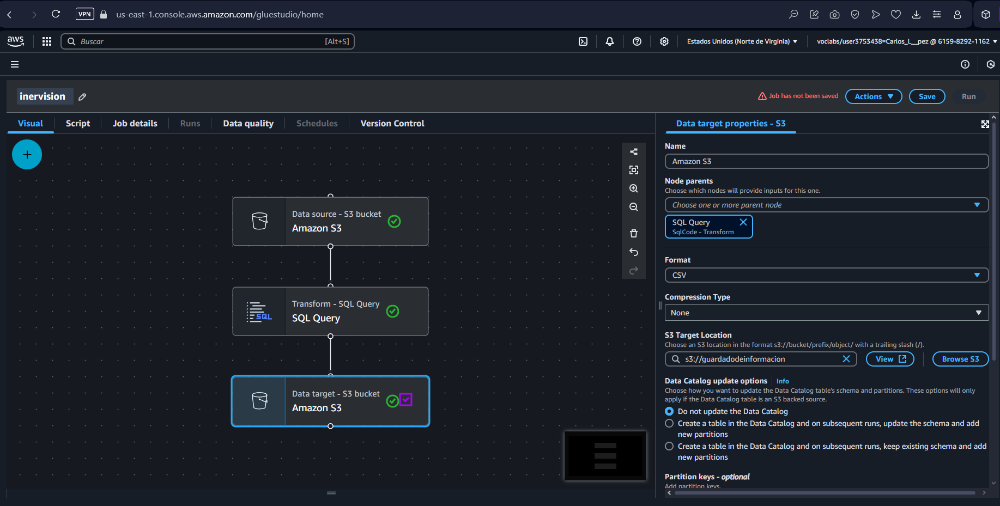  

# 🛠️ **Diseño de la ETL en AWS Glue (Modo Visual)**  

La imagen muestra la configuración de una ETL en **AWS Glue Studio**, utilizando el **modo visual** para procesar los datos de un bucket de **Amazon S3**, transformarlos con **SQL Query** y almacenarlos nuevamente en **S3**.  

---

## 🔍 **Estructura de la ETL en la imagen**  

1️⃣ **Fuente de Datos: Amazon S3**   
   - Se carga la información desde un **bucket de S3**.  
   - Esto puede ser un conjunto de archivos **CSV, JSON u otro formato compatible**.  

2️⃣ **Transformación: SQL Query**  
   - Se aplica una transformación utilizando **SQL**.  
   - Aquí se pueden **filtrar, modificar columnas o unir datasets**.  

3️⃣ **Destino de Datos: Amazon S3**   
   - Los datos transformados se guardan en otro **bucket de S3**.  
   - En este caso, se ha seleccionado el formato **CSV** y se ha definido una ubicación específica.  

---

## **Cómo debería haber sido la ETL**  

🔹 **El diseño visual permite realizar muchas operaciones de transformación**, pero tiene **limitaciones** cuando se requiere personalización avanzada.  

🔹 En nuestro caso, el **modo visual es útil hasta cierto punto**, pero **necesitamos cambiar a código (PySpark)** para:  
   - **Unir múltiples archivos en uno solo**.  
   - **Aplicar transformaciones más flexibles** que no se pueden realizar con la interfaz visual.  
   - **Definir bien el formato** en el almacenamiento del S3.  

📌 **A continuación, explicaremos el código que reemplazará esta configuración para lograr la ETL completa en AWS Glue.** 🚀  

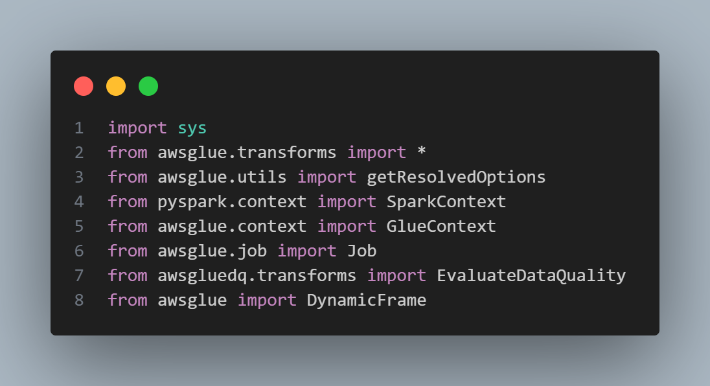  

## 🚀 **Importaciones necesarias**  

Este código **prepara el entorno** para ejecutar una tarea en **AWS Glue**, una herramienta que ayuda a procesar datos de manera eficiente en la nube ☁️📊.  

### 🛠️ **¿Qué hace cada línea?**  

1. **Importa librerías esenciales**   
   - `sys`: Permite interactuar con el sistema operativo y gestionar argumentos.  
   - `awsglue.transforms`: Contiene funciones para transformar datos dentro de AWS Glue.  
   - `awsglue.utils.getResolvedOptions`: Sirve para obtener parámetros que se pasan al script desde AWS Glue.  

2. **Configura el entorno de ejecución en Spark**   
   - `SparkContext`: Crea el contexto de Spark, que es el motor que procesará los datos en paralelo.  
   - `GlueContext`: Un entorno especial de AWS Glue que facilita la integración con otros servicios de AWS.  
   - `Job`: Permite definir una **tarea en AWS Glue**, facilitando su ejecución y seguimiento.  

3. **Evalúa la calidad de los datos** 
   - `EvaluateDataQuality`: Un módulo de AWS Glue que **verifica si los datos son correctos** y cumplen con ciertos estándares antes de seguir procesándolos.  

4. **Usa `DynamicFrame` en lugar de DataFrames tradicionales**   
   - `DynamicFrame`: Una versión mejorada de los DataFrames de Spark, diseñada para trabajar con datos en AWS Glue.  
   - Permite **manejar datos semiestructurados** y **hacer transformaciones fácilmente** sin necesidad de definir un esquema fijo.  

---

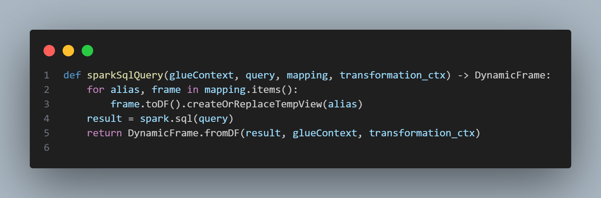     

## **Función `sparkSqlQuery`**  

Esta función permite **ejecutar consultas SQL en datos almacenados en AWS Glue**. Es útil para **transformar y analizar los datos** sin necesidad de escribir código complejo, solo utilizando SQL. 📊💡  

### **¿Cómo funciona?**  

1. **Recibe los siguientes parámetros** 
   - 🏗️ `glueContext`: Proporciona acceso a AWS Glue y su integración con Spark.  
   - 📜 `query`: La consulta SQL que se aplicará a los datos.  
   - 🔄 `mapping`: Un diccionario donde **las claves son nombres de tablas temporales** y **los valores son `DynamicFrame` con los datos a procesar**.  
   - 🔍 `transformation_ctx`: Identificador que permite rastrear la transformación dentro de Glue.  

2. **Convierte los `DynamicFrame` en tablas temporales**  
   - 📌 **Recorre cada elemento en `mapping`**, extrayendo el alias (nombre de la tabla) y los datos (`DynamicFrame`).  
   - 🗂️ **Transforma cada `DynamicFrame` en un `DataFrame` de Spark** para poder consultarlo con SQL.  
   - 🏷️ **Crea una tabla temporal** (`createOrReplaceTempView(alias)`) para que la consulta SQL pueda referirse a ella.  

3. **Ejecuta la consulta SQL sobre los datos**   
   - 📊 Utiliza `spark.sql(query)` para aplicar la transformación deseada.  

4. **Convierte el resultado en un `DynamicFrame` nuevamente**  
   - ✨ `DynamicFrame.fromDF(result, glueContext, transformation_ctx)`:  
     - **Toma los datos procesados** y los **devuelve en formato `DynamicFrame`**.  
     - Esto permite **seguir aplicando transformaciones** en AWS Glue sin problemas.  

---

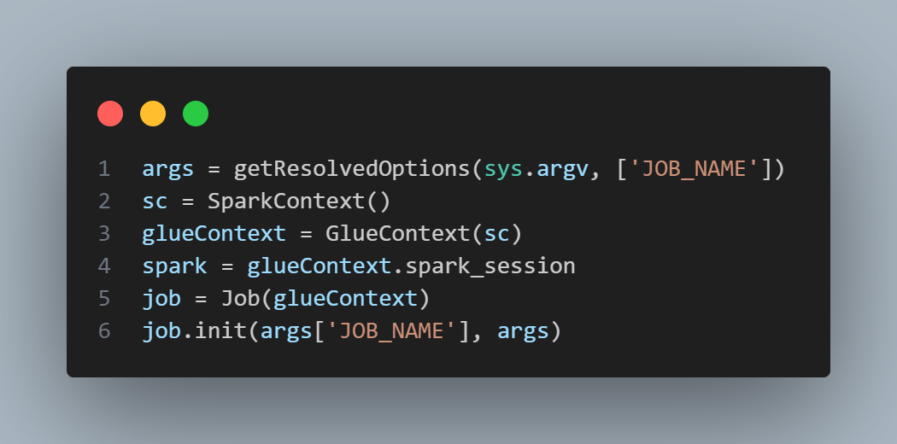  

## **Configuración del Entorno en AWS Glue**  

Este fragmento de código **inicializa el entorno de ejecución en AWS Glue**, preparando Spark para procesar datos en la nube. 

### 🛠️ **¿Cómo funciona?**  

1. **Obtiene los parámetros del trabajo en Glue** 
   - `args = getResolvedOptions(sys.argv, ['JOB_NAME'])`  
   -  Extrae el nombre del trabajo desde los **argumentos que recibe el script** cuando se ejecuta en AWS Glue.  
   - `JOB_NAME` es el identificador del trabajo dentro de AWS.  

2. **Inicializa Spark**   
   - `sc = SparkContext()`  
   -  Crea el **contexto de Spark**, necesario para ejecutar tareas de procesamiento de datos en paralelo.  

3. **Crea el contexto de AWS Glue** 🛠️  
   - `glueContext = GlueContext(sc)`  
   -  Permite que AWS Glue utilice Spark para transformar y manejar datos de forma eficiente.  
   -  **Facilita la conexión con otras herramientas de AWS** como S3, Redshift o DynamoDB.  

4. **Obtiene la sesión de Spark**   
   - `spark = glueContext.spark_session`  
   - **Crea una sesión de Spark**, que es necesaria para ejecutar consultas y manipular datos.  

5. **Inicializa el trabajo en Glue**   
   - `job = Job(glueContext)`  
   -  Crea una **instancia de trabajo en AWS Glue**, permitiendo **controlar su ejecución y finalizarlo correctamente**.  
   - `job.init(args['JOB_NAME'], args)`:  
     - **Inicia el trabajo** con el nombre que se obtuvo en el primer paso.  
     - **Permite que AWS Glue rastree y administre el estado del trabajo.**  

---

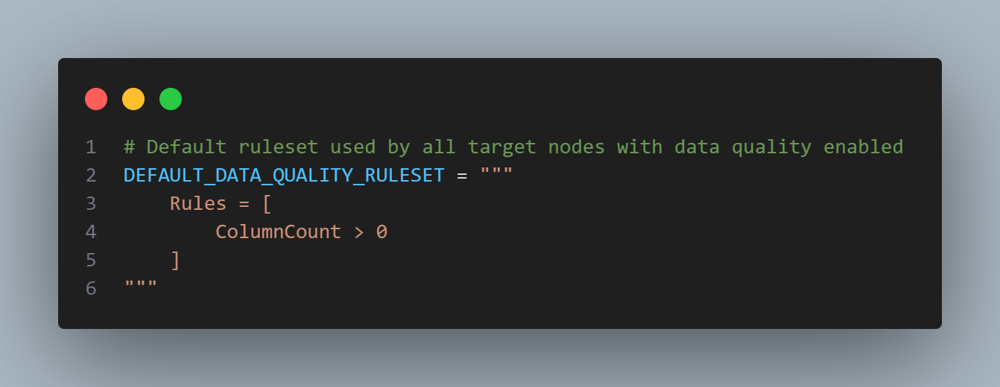  

## 📏 **Reglas por Defecto para la Calidad de Datos**  

Este fragmento define un **conjunto de reglas básicas** que AWS Glue utilizará para **validar la calidad de los datos** antes de procesarlos.   

### 🛠️ **¿Cómo funciona?**  

1. **Define un conjunto de reglas de calidad de datos** 
   - Se almacena en la variable `DEFAULT_DATA_QUALITY_RULESET`.  
   - Contiene un conjunto de reglas que AWS Glue **aplicará automáticamente** a todos los nodos de destino que tengan habilitada la validación de calidad de datos.  

2. **Reglas establecidas**   
   - `ColumnCount > 0`  
   -  **Verifica que la tabla tenga al menos una columna**.  
   -  **Evita procesar datos vacíos o estructuras incorrectas** que podrían causar errores más adelante.  

---

  

## **Carga de Datos desde Amazon S3**  

Este fragmento de código **lee un archivo CSV almacenado en Amazon S3** y lo convierte en un `DynamicFrame` para su procesamiento en AWS Glue.   

### 🛠️ **¿Cómo funciona?**  

1. **Configura la lectura de datos desde S3** 
   - `AmazonS3_node1740744770173 = glueContext.create_dynamic_frame.from_options(...)`  
   - **Convierte los datos en un `DynamicFrame`**, que es un formato optimizado para AWS Glue.  

2. **Define las opciones de formato**   
   - `format_options={"quoteChar": "\"", "withHeader": True, "separator": ","}`  
   - `quoteChar`: Usa `"` para manejar valores entre comillas.  
   - `withHeader`: Indica que el CSV tiene una fila de encabezados.  
   - `separator`: Especifica que las columnas están separadas por comas (`,`).  

3. **Especifica la fuente de datos**   
   - `connection_type="s3"`: Indica que los datos provienen de un **bucket de Amazon S3**.  
   - `connection_options={"paths": ["s3://inervisionai"], "recurse": True}`  
     - **Ruta del bucket**: `s3://inervisionai`.  
     - `recurse=True`: Permite leer archivos dentro de subcarpetas.  

4. **Asigna un identificador al proceso de transformación** 🔍  
   - `transformation_ctx="AmazonS3_node1740744770173"`  
   - AWS Glue usa este identificador para rastrear y organizar las transformaciones aplicadas al `DynamicFrame`.  

---

## 🖥️ **Consulta SQL para Clasificación de Marcas**  

Este fragmento de código SQL **clasifica los productos según su marca** 🏷️. La consulta revisa el nombre de cada producto y asigna una marca específica si detecta ciertas palabras clave.  

### 🛠️ **¿Cómo funciona?**  

1. **Selecciona todas las columnas del dataset** 📊  
   - `SELECT *,`  
   - 🔄 Mantiene todos los datos originales del conjunto de datos (`myDataSource`).  

2. **Crea una nueva columna llamada `Marca`** 🏷️  
   - `CASE WHEN lower(Nombre del Producto) LIKE '%logitech%' THEN 'Logitech'`  
   - 🔍 **Convierte el nombre del producto a minúsculas** (`lower(Nombre del Producto)`) para evitar problemas con mayúsculas/minúsculas.  
   - 🔎 Si el nombre del producto contiene `"logitech"`, asigna la marca `"Logitech"`.  
   - 🏷️ Este mismo proceso se repite para otras marcas como **Razer, Corsair, Asus, MSI, Apple, etc.**  

3. **Si el producto no coincide con ninguna marca conocida** ❓  
   - `ELSE 'Otra'`  
   - 🏷️ Si el producto **no pertenece a ninguna marca listada**, se le asigna la categoría `"Otra"`.  

4. **Aplica la consulta sobre la fuente de datos** 💾  
   - `FROM myDataSource;`  
   - 📌 `myDataSource` es el nombre de la tabla o `DynamicFrame` que contiene los datos originales.  

---

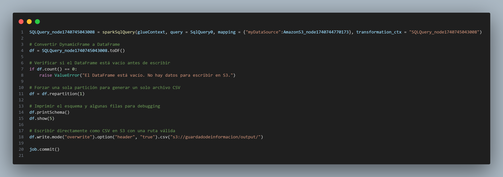  

## 🚀 **Ejecución de Consulta SQL y Almacenamiento en Amazon S3**  

Este fragmento de código **ejecuta una consulta SQL en los datos, transforma el resultado y lo guarda en un archivo CSV en Amazon S3**. 📊☁️  

### 🛠️ **¿Cómo funciona?**  

1. **Ejecuta la consulta SQL sobre los datos de Amazon S3** 🖥️  
   - Se usa la función `sparkSqlQuery` para ejecutar la consulta SQL almacenada en `SqlQuery0`.  
   - Los datos provienen de `AmazonS3_node1740744770173` y se asigna un alias (`myDataSource`) para facilitar la consulta.  
   - El resultado de la consulta se guarda en `SQLQuery_node1740745043008`, que será utilizado en los siguientes pasos.  

2. **Convierte el resultado en un `DataFrame` de Spark** 🔄  
   - Se transforma el `DynamicFrame` resultante de la consulta en un `DataFrame` para poder manipular los datos con mayor facilidad.  

3. **Verifica si hay datos antes de continuar** ❗  
   - Antes de escribir en Amazon S3, se comprueba que el `DataFrame` no esté vacío.  
   - Si no hay datos, se genera un error (`ValueError`) y el proceso se detiene para evitar archivos vacíos en S3.  

4. **Reduce el número de particiones para generar un solo archivo CSV** 📂  
   - Se reorganizan los datos en una única partición para que Spark genere un solo archivo CSV en lugar de múltiples fragmentos.  

5. **Muestra el esquema y algunas filas para depuración** 🔍  
   - Se imprime la estructura de las columnas del `DataFrame` para verificar su formato.  
   - Se muestran las primeras cinco filas para comprobar que los datos se han procesado correctamente.  

6. **Guarda el resultado en Amazon S3 en formato CSV** ☁️  
   - Se escribe el `DataFrame` en Amazon S3 en formato CSV con sobrescritura activada, lo que significa que si el archivo ya existe, se reemplazará.  
   - Se incluye la opción de encabezados para que el archivo CSV mantenga los nombres de las columnas.  

7. **Confirma que el trabajo ha finalizado** ✅  
   - Se ejecuta el comando `job.commit()`, lo que indica que el trabajo en AWS Glue ha finalizado correctamente.  

---


## 4. Exploración y visualización de los datos. Se realizará un estudio de los datos buscando correlaciones, mostrando gráficas de diferente tipología, observando si hay valores nulos, etc.


# **Almacenamiento de Imágenes en CSV**  

Después de eliminar las imágenes no deseadas, el siguiente paso es **registrarlas en un archivo CSV**. 📂🔄  

## 🎯 **¿Por qué guardar las imágenes en un CSV?**  

🔹 **Organización** → Permite estructurar los datos para su fácil análisis.  
🔹 **Accesibilidad** → Un CSV es ligero y compatible con múltiples herramientas de análisis.  

---

   

# 📂 **Definición de Carpetas y Lista de Datos**  

Antes de procesar las imágenes, es necesario **definir las carpetas de origen** y **crear una lista para almacenar la información** extraída. 🖼️📊  

---

## 🛠️ **¿Cómo funciona esta parte del código?**  

1️⃣ **Definir las carpetas donde están las imágenes** 📂  
   - `carpetas_principales = ["../../ikea_muebles/sillas"]`  
   - Se establece una lista con **las rutas de las carpetas principales**, donde se encuentran las imágenes organizadas en subcarpetas.  
   - En este caso, se está procesando la carpeta `"sillas"` dentro de `"ikea_muebles"`.  

2️⃣ **Crear una lista para almacenar los datos** 📝  
   - `data = []`  
   - Se inicializa una **lista vacía** que **almacenará la información de cada imagen**.  
   - Posteriormente, en esta lista se guardarán datos como:  
     - 🖼️ `Nombre del archivo`  
     - 📂 `Ruta de la imagen`  
     - 🔠 `Imagen codificada en base64`  

---

  

# **Función `procesar_carpeta`**  

Esta función **recorre carpetas y subcarpetas**, buscando imágenes, **convirtiéndolas a Base64** y almacenándolas en una lista con formato HTML. 📂📊  

---

## 🛠️ **¿Cómo funciona?**  

1️⃣ **Recorre todas las carpetas y subcarpetas** 🔄  
   - `os.walk(os.path.abspath(carpeta_raiz))`  
   - Convierte la **ruta relativa en absoluta** para evitar errores.  
   - **Recorre recursivamente** todas las carpetas y subcarpetas dentro de `carpeta_raiz`.  

2️⃣ **Filtra archivos de imagen** 🏷️  
   - `if archivo.lower().endswith(('.png', '.jpg', '.jpeg', '.gif')):`  
   - **Solo procesa archivos de imagen** con extensiones comunes.  
   - Ignora otros tipos de archivos no relevantes.  

3️⃣ **Convierte la imagen a Base64** 🔄  
   - `with open(ruta_imagen, "rb") as img_file:`  
   - Abre la imagen en **modo lectura binaria (`rb`)**.  
   - `base64.b64encode(img_file.read()).decode('utf-8')`  
   - **Codifica la imagen en Base64** y la convierte en un **string de texto**.  

4️⃣ **Genera una etiqueta HTML con la imagen en Base64** 🖼️  
   - `img_html = f''`
   - Se establece un **ancho de `100px`** para previsualización.  

5️⃣ **Agrega la imagen a la lista de datos** 📋  
   - `data.append([img_html])`  
   - Guarda la información en la lista `data`, para su posterior almacenamiento en CSV.  

6️⃣ **Manejo de errores** ⚠️  
   - Si ocurre algún problema al procesar una imagen, el error **se muestra en consola** y el programa sigue ejecutándose.  

---

  

# 📄 **Conversión de Imágenes a CSV**  

Después de procesar todas las imágenes, este código **crea un DataFrame y lo guarda en un archivo CSV**, asegurando que esté listo para el entrenamiento del modelo.

---

## 🛠️ **¿Cómo funciona?**  

1️⃣ **Procesa todas las carpetas principales** 📂  
   - `for carpeta in carpetas_principales:`  
   - **Recorre cada carpeta** y ejecuta `procesar_carpeta(carpeta)`.  
   - Se almacenan las imágenes **convertidas a Base64 con formato HTML** en la lista `data`.  

2️⃣ **Crea un DataFrame con los datos** 🏗️  
   - `df = pd.DataFrame(data, columns=["chair"])`  
   - Se genera un **DataFrame de Pandas** con una columna llamada `"chair"`.  
   - **Cada fila contiene una imagen en formato Base64 con etiqueta HTML**.  

3️⃣ **Guarda el DataFrame en un archivo CSV** 💾  
   - `csv_path = "chair.csv"` define el nombre del archivo.  
   - `df.to_csv(csv_path, index=False, encoding="utf-8-sig", quoting=csv.QUOTE_MINIMAL, escapechar="\\")`  
     - 🔹 **`index=False`** → No guarda el índice del DataFrame.  
     - 🔹 **`encoding="utf-8-sig"`** → Asegura compatibilidad con **Excel**.  
     - 🔹 **`quoting=csv.QUOTE_MINIMAL`** → Evita problemas con comillas en los datos.  
     - 🔹 **`escapechar="\\ "`** → Escapa caracteres especiales para evitar errores en la lectura del CSV.  

4️⃣ **Muestra un mensaje de éxito** ✅  
   - `print(f"✅ Archivo CSV guardado correctamente en: {csv_path}")`  
   - Confirma que el archivo se ha guardado **sin errores y listo para su análisis**.  

---
 
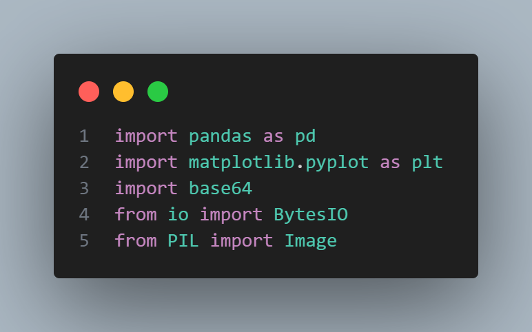

# 📦 **Importación de Módulos para la Prueba y Visualización**  

Antes de verificar el correcto funcionamiento de los datos, necesitamos **importar las librerías necesarias** para **cargar, procesar y visualizar las imágenes** almacenadas en el CSV.  

---

## 🛠️ **¿Qué hace cada módulo?**  

1️⃣ **`pandas` → Manejo de Datos Tabulares** 
   - `import pandas as pd`  
   - Permite **cargar el CSV** y trabajar con él como un **DataFrame**.  
   - Se usará para leer y verificar la estructura de los datos.  

2️⃣ **`matplotlib.pyplot` → Visualización de Datos** 
   - `import matplotlib.pyplot as plt`  
   - Nos permite **mostrar las imágenes** contenidas en el CSV.  
   - Se usará para graficar y confirmar que las imágenes se han guardado correctamente.  

3️⃣ **`base64` → Decodificación de Imágenes**  
   - `import base64`  
   - Convierte las imágenes **de Base64 a un formato visualizable**.  
   - Se usará para reconstruir las imágenes almacenadas en el CSV.  

4️⃣ **`BytesIO` → Manejo de Archivos en Memoria**   
   - `from io import BytesIO`  
   - Permite trabajar con **imágenes sin necesidad de guardarlas en disco**.  
   - Se usará para cargar imágenes directamente en memoria antes de visualizarlas.  

5️⃣ **`PIL.Image` → Procesamiento de Imágenes** 
   - `from PIL import Image`  
   - Nos permite **abrir, procesar y mostrar imágenes** en Python.  
   - Se usará para reconstruir las imágenes en Base64 y mostrarlas en pantalla.  

---

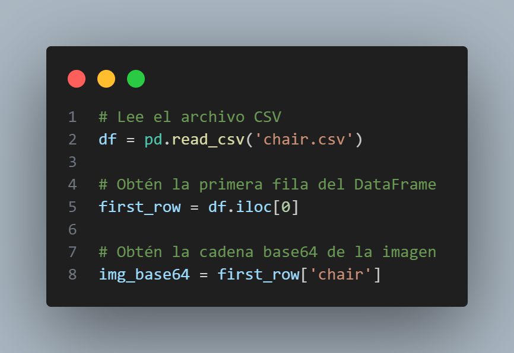

# 📄 **Lectura y Extracción de Imágenes desde CSV**  

En este paso, **cargamos el archivo CSV y extraemos la primera imagen** almacenada en formato Base64 para verificar su correcta codificación. 

---

## 🛠️ **¿Cómo funciona?**  

1️⃣ **Carga el archivo CSV**   
   - `df = pd.read_csv('chair.csv')`  
   - **Lee el archivo `chair.csv`** usando Pandas y lo almacena en un **DataFrame**.  
   - Contiene la columna `"chair"` con imágenes en formato **Base64 dentro de etiquetas HTML**.  

2️⃣ **Obtiene la primera fila del DataFrame**   
   - `first_row = df.iloc[0]`  
   - Usa `.iloc[0]` para **seleccionar la primera fila** del DataFrame.  
   - Se extrae una imagen **para verificar que los datos están bien guardados**.  

3️⃣ **Extrae la imagen en Base64**   
   - `img_base64 = first_row['chair']`  
   - Se accede a la columna `"chair"` de la primera fila.  
   - **Aquí se encuentra el código Base64 dentro de una etiqueta HTML**.  

---


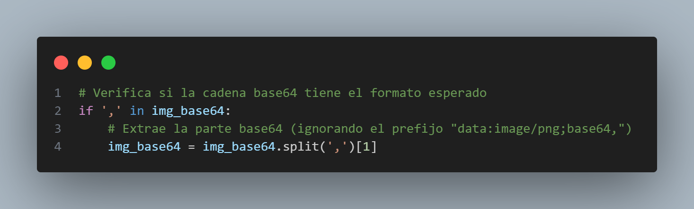


# **Verificación, Decodificación y Visualización de la Imagen**  

Este código **verifica que la imagen en Base64 esté en el formato correcto, la decodifica y la muestra en pantalla**.   

---

## 🛠️ **¿Cómo funciona?**  

1️⃣ **Verifica si la cadena Base64 tiene un prefijo de datos**   
   - `if ',' in img_base64:`  
   - Algunas imágenes en Base64 **pueden incluir un prefijo**, por ejemplo:  
     ```
     data:image/png;base64,iVBORw...
     ```
   - Si hay una coma `,`, significa que el prefijo está presente.  
   - `img_base64.split(',')[1]` extrae **solo la parte Base64**, eliminando `"data:image/png;base64,"`.  

2️⃣ **Asegura que la longitud de la cadena sea un múltiplo de 4**   
   - `padding = len(img_base64) % 4`  
   - Base64 **debe tener una longitud en múltiplos de 4**.  
   - Si no lo es, **se agregan los caracteres `=` necesarios** para corregir la cadena.  
   - `img_base64 += '=' * (4 - padding)` **corrige la longitud si es necesario**.  

3️⃣ **Intenta decodificar la imagen** 
   - `img_data = base64.b64decode(img_base64)`  
   - Convierte la cadena **de Base64 a datos binarios de imagen**.  

4️⃣ **Convierte los datos en una imagen visualizable**   
   - `img = Image.open(BytesIO(img_data))`  
   - Usa `BytesIO` para **convertir los datos binarios en una imagen sin guardarla en disco**.  
   - `Image.open()` abre la imagen lista para ser visualizada.  

5️⃣ **Muestra la imagen**   
   - `plt.figure()` → Crea una nueva figura para la imagen.  
   - `plt.imshow(img)` → Muestra la imagen decodificada.  
   - `plt.axis('off')` → Oculta los ejes para mejorar la visualización.  
   - `plt.show()` → Muestra la imagen en pantalla.  

6️⃣ **Manejo de errores**   
   - Si ocurre un error en la decodificación, se captura con `except Exception as e`.  
   - Se imprime un mensaje de error con `print(f"Error al decodificar la imagen: {e}")`.  

---

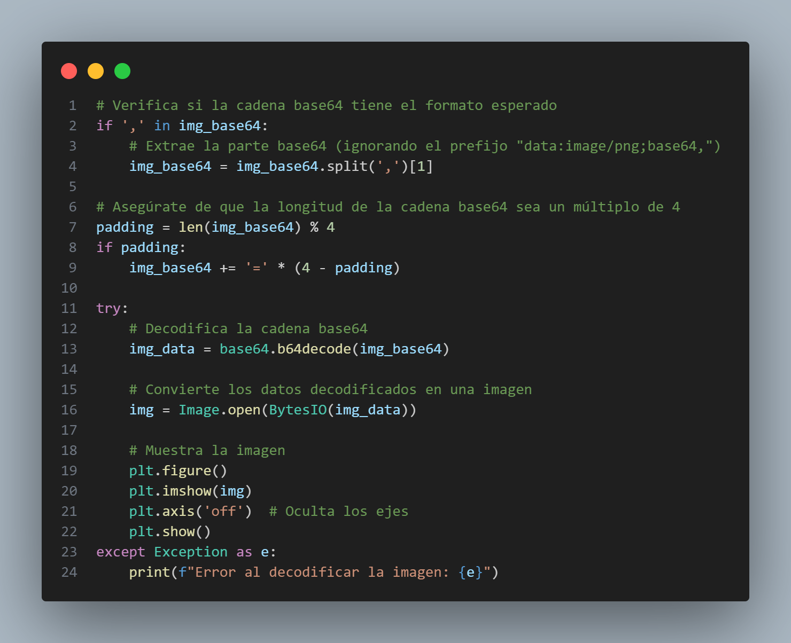 

# 🖱️ **Verificación de Datos de Ratones**  

Ahora que hemos extraído y almacenado los datos, **vamos a verificar su integridad** antes de proceder con la visualización en Power BI. 📊  

---

## 🛠️ **¿Cómo funciona esta prueba?**  

1️⃣ **Carga el archivo CSV** 
   - `df_datos = pd.read_csv('/content/ratones_p1.csv')`  
   - Usa Pandas para **leer los datos almacenados en el archivo CSV**.  

2️⃣ **Muestra las primeras filas** 
   - `print(df_datos.head())`  
   - Permite visualizar las primeras 5 filas del dataset para asegurarnos de que los datos están bien organizados.  

3️⃣ **Cuenta los valores nulos por columna** 
   - `print(df_datos.isna().sum())`  
   - Muestra **cuántos valores nulos hay en cada columna**, ayudando a identificar posibles problemas en los datos.  

---

## 📊 **Visualización de Datos en Power BI**  

Una vez que hemos procesado y comprobado de que no tiene **null** en ninguna fila, el siguiente paso es **visualizarlos en Power BI** para analizarlos de manera más intuitiva. 📈✨  

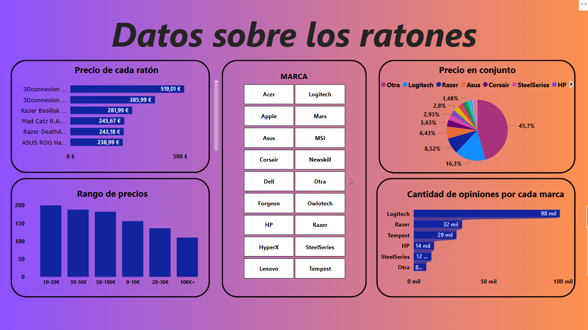

Para visualizar el Power Bi de manera interactiva [aqui](https://app.powerbi.com/links/GojVNB_DqB?ctid=e0793d39-0939-496d-b129-198edd916feb&pbi_source=linkShare). **Nota** : Es importante tener cuenta de power BI para poder acceder. 

## 5. Preparación de los datos para los algoritmos de Machine Learning. Se deben tratar los datos (limpiando, escalando, separando y todo lo que sea necesario) de tal forma que queden listos para entrenar el modelo.
### 5.1 Proceso de Fine-Tuning con YOLOv5

El objetivo del fine-tuning es adaptar un modelo preentrenado de YOLOv5 (yolov5nu.pt) a nuestro dataset, mejorando su capacidad de detección en nuestro caso de uso específico.

### 📂 5.1.1 Preparación del Dataset
Para entrenar el modelo, primero preparamos los datos siguiendo los pasos detallados a continuación:

1️⃣ Obtención del Dataset

Realizamos scraping de imágenes, almacenándolas en un archivo CSV en formato base64.

📌 Ejemplo de archivo:


---

2️⃣ Conversión de Imágenes

Como las imágenes estaban almacenadas en formato base64, era necesario decodificarlas para poder usarlas en el entrenamiento.

Utilizamos el siguiente script en Python para convertir las imágenes de base64 a `.jpg`:


---

3️⃣ Etiquetado de Imágenes

Para entrenar un modelo de detección de objetos, cada imagen necesita etiquetas con las coordenadas de los objetos. Utilizamos **Roboflow**, una plataforma que permite:

- ✅ Subir imágenes.
- ✅ Etiquetar imágenes manualmente o automáticamente con herramientas de anotación.
- ✅ Convertir el dataset a formatos compatibles con modelos de detección como YOLOv5.
- ✅ Dividir los datos en conjuntos de entrenamiento, validación y prueba.

Nuestro objetivo fue **etiquetar automáticamente** imágenes del dataset para detectar objetos de interés y exportarlas en formato YOLOv5.

🔹 Creación de un Proyecto en Roboflow

- Asignamos un nombre al proyecto, por ejemplo: cupboard_detection.
- Seleccionamos el tipo de modelo: Object Detection (YOLOv5, COCO, etc.)


  

🔹 Subida de Imágenes al Proyecto


🔹 Etiquetado Automático de Objetos

Dado que Roboflow cuenta con herramientas de etiquetado automático, utilizamos esta opción para generar anotaciones sin intervención manual.


Si bien el etiquetado automático es preciso, verificamos que las anotaciones fueran correctas.


En caso de errores, ajustamos manualmente las etiquetas antes de continuar para completar el proceso.


Después de la comprobación añadimos las etiquetas aprobadas.


🔹 Exportación del Dataset en Formato YOLOv5

Para utilizar las imágenes etiquetadas en el entrenamiento del modelo, exportamos el dataset en formato YOLOv5.

Roboflow nos permite dividir el dataset en tres subconjuntos:
- 80% para entrenamiento (train)
- 10% para validación (valid)
- 10% para prueba (test)


En la sección de exportación, seleccionamos YOLOv5 como formato de salida y descargamos un archivo ZIP.


El archivo ZIP tiene la siguiente estructura:

```
/dataset
│── test/    # 10% de imágenes para prueba
│   ├── images/
│   ├── labels/   
│
│── train/   # 80% de imágenes para entrenamiento
│   ├── images/
│   ├── labels/
|
│── valid/   # 10% de imágenes para validación
│   ├── images/
│   ├── labels/
│
│── data.yaml    # Archivo de configuración del dataset
```

En el directorio `labels` obtenemos archivos .txt con las coordenadas de los objetos.


### 🛠 5.1.2 Entrenamiento del Modelo

Para el entrenamiento utilizamos el modelo preentrenado **yolov5nu.pt**. Ejecutamos el proceso en Google Colab con GPU habilitada para acelerar el cómputo. Clonamos el repositorio de YOLOv5. Usamos los siguientes parámetros en el script de entrenamiento:

```python
!python train.py \
  --weights /content/drive/MyDrive/Models/yolov5nu.pt \
  --data /content/drive/MyDrive/YOLO_Dataset/data.yaml \
  --epochs 50 \
  --batch-size 16 \
  --imgsz 640 \
  --optimizer SGD \
  --device 0
```

Sin embargo, durante la ejecución del entrenamiento encontramos errores relacionados con la configuración de los anchors en el modelo. El siguiente es un ejemplo de los errores que recibimos:

```
RuntimeError: shape '[3, -1, 2]' is invalid for input of size 3
```

Este error sugiere que los anchors definidos en el modelo no se ajustaban correctamente al número de clases u otras dimensiones esperadas. Intentamos modificar la configuración, pero el problema persistió.

---

⚠️ Problemas Encontrados y Conclusión

No logramos completar el fine-tuning debido a erroresencontrados. Las posibles causas incluyen:

1. **Incompatibilidad en los anchors**: La configuración de los anchors puede no haber sido adecuada para nuestro dataset. 
2. **Formato incorrecto en el archivo data.yaml**: Es posible que las clases o los parámetros en el archivo no estuvieran correctamente definidos.
3. **Modelo preentrenado incompatible**: Puede que el modelo **yolov5nu.pt** no estuviera configurado correctamente para ser reutilizado con nuevos datos.

Para solucionar estos problemas, proponemos:
- Revisar el formato de **data.yaml** y asegurarnos de que está bien definido.
- Ajustar los anchors manualmente o permitir que YOLO los recalibre automáticamente.
- Probar con otro modelo preentrenado de YOLOv5 para verificar compatibilidad.

A pesar de las dificultades, este proceso nos permitió comprender mejor el flujo de trabajo de YOLOv5 y los retos asociados a la personalización de modelos de detección de objetos. Con algunos ajustes, creemos que podemos completar con éxito el fine-tuning en futuras iteraciones.


## 6. Entrenamiento del modelo y comprobación del rendimiento. Se entrenarán uno o varios modelos, comprobando en cada caso el rendimiento que ofrecen mediante las apropiadas medidas de error y/o acierto.

### 6.1 Uso de YOLOv5 de Ultralytics y Chatbot personalizado

En este apartado, se describe el proceso de implementación de YOLOv5 de Ultralytics, desde la configuración del entorno hasta la integración con una API en Flask y un frontend en React. El objetivo es demostrar cómo este modelo puede ser utilizado para detectar objetos en tiempo real, enviando los resultados de las detecciones a una interfaz gráfica que permite visualizar las predicciones de manera intuitiva. 
Además, se aborda la importancia de optimizar el flujo de trabajo para garantizar un rendimiento óptimo, especialmente como tratar el funcionamiento con recursos gratuitos y el limite que establece Netlify y nuestra API con Flask en local.

También ideamos un chatbot con una API-KEY de OpenAI, donde con base en nuestro README.md, procese y responda preguntas y cuestiones sobre nuestro proyecto debido a, que nuestro readme va a ser bastante extenso.

Primero explicaremos el funcionamiento de YOLOv5 con Ultralytics.

#### Uso de la API con Flask

La API desarrollada con Flask sirve como el núcleo del proyecto, facilitando la comunicación entre el modelo de detección de objetos YOLOv5 y el chatbot basado en OpenAI. Esta API maneja tanto el procesamiento de imágenes en tiempo real mediante WebSockets como la interacción con el chatbot mediante solicitudes REST.

#### Configuración del Entorno

Antes de ejecutar la API, es necesario asegurarse de que se tienen instaladas todas las dependencias necesarias. Se pueden instalar mediante:

```bash
pip install -r requirements.txt
python app.py
```

(Aconsejable hacer un environment si necesitas versiones específica)

Como la versión de Python que usamos era la 3.10, con ejecutar el comando de arriba, te instalará siempre lo último de esta versión en concreto de python.

#### Uso de WebSocket para Detección de Objetos con YOLOv5

La API emplea flask_socketio para recibir imágenes desde el frontend en tiempo real, procesarlas con YOLOv5 y devolver las detecciones correspondientes.

#### Flujo de Trabajo

- El frontend envía frames codificados en base64 mediante WebSocket.

- La API recibe y decodifica la imagen, luego la redimensiona para mejorar la eficiencia.

- YOLOv5 procesa la imagen y genera predicciones sobre los objetos detectados.

- La API envía las detecciones de vuelta al frontend a través de WebSocket.


Aunque la anterior imagen representa la función y puede ser engorrosa, la siguiente captura será la zona importante y vital de entender.
Esta parte es la más importante ya que sin ella, no podríamos representar en el frontend mediante el uso de canvas, pintar los rectángulos de la detección de objetos ya que nos da:
- Las posiciones de cada objeto
- Redonde el score del objeto a 2 decimales
- Gracias a la id, accedemos al nombre de la clase, por ejemplo, 0 - Persona
- Añadimos esto a una lista finalmente
  


#### Uso de API REST para el Chatbot Personalizado

Para permitir que los usuarios interactúen con el chatbot, la API implementa un endpoint /chat que recibe preguntas del usuario y responde basándose en el contenido del README.md del proyecto.

#### Flujo de Trabajo

- El usuario envía una solicitud POST a /chat con el mensaje en formato JSON.

- La API obtiene el contenido del README.md desde GitHub.

- Se construye un mensaje para OpenAI combinando la pregunta del usuario y la información del README.md.

- La API envía la solicitud a OpenAI y devuelve la respuesta generada.

La parte del frontend será expuesta en la sección **8. Desarrollo de la Aplicación Web**


Vemos aquí mas directamente la parte importante, que usará el rol de system, con lo cual nos permite generar un prompt anterior al promt del usuario, donde gracias a esta función, transformamos el readme...


Para conseguir así finalmente que "sesgemos" al modelo para que responda preguntas con base en nuestro Readme.


Las demás lineas de código son necesarias para permisos y utilidad como:

**CORS**


**Optimización YOLO**


---

## 7. Se tiene que incluir alguna de las técnicas estudiadas en el tema de Procesamiento de Lenguaje Natural: expresiones regulares, tokenización, generación de texto, análisis de sentimientos, etc.

En el proyecto hemos integrado diversas técnicas de **Procesamiento de Lenguaje Natural (PLN)** para mejorar la interacción con el usuario y optimizar el análisis de texto.

### 7.1. Uso de Expresiones Regulares en el Formateo de Respuestas del Chatbot

En la página de `Chatbot.tsx` hemos desarrollado una función llamada `formatResponse()`, cuya finalidad es mejorar la legibilidad de los mensajes del chatbot al usuario. Para ello, aplicamos **expresiones regulares** que permiten transformar ciertos patrones de texto en formato HTML.

📌 Código de la función:


Desglose del código:

1️⃣ `replace(/\*\*(.*?)\*\*/g, '<strong>$1</strong>')`:

- Busca cualquier texto encerrado entre `**` y lo reemplaza por `<strong>`, convirtiéndolo en negrita.
- Ejemplo: `"Este es un **mensaje importante**"` → `"Este es un <strong>mensaje importante</strong>"`.

2️⃣ `replace(/\n/g, '<br>')`:

- Reemplaza los saltos de línea (`\n`) por etiquetas HTML `<br>`, asegurando que el texto respete los espacios entre líneas.
- Ejemplo: `"Línea 1\nLínea 2"` → `"Línea 1<br>Línea 2"`.

3️⃣ `replace(/\d+\. /g, '<br>• ')`:

- Busca listas numeradas (`1. Texto`, `2. Texto`, etc.) y las convierte en listas con viñetas (`• Texto`).
- Ejemplo:
  
```plaintext
1. Manzana
2. Pera
```
Se transformará en:
```html
Copiar
Editar
<br>• Manzana
<br>• Pera
```

## 8. Desarrollo de la Aplicación Web

Nuestra aplicación web ha sido desarrollada utilizando **React** e **Ionic** con **TypeScript**, proporcionando una experiencia moderna y responsiva. A continuación, describimos los principales componentes de la web junto con capturas del código y la interfaz.

### 8.1 Estructura del Proyecto

El proyecto se organiza en distintos componentes de React y páginas específicas para cada funcionalidad. Nuestra estructura principal incluye:
- **Home.tsx** (Página de inicio)
- **Model.tsx** (Módulo de detección de objetos)
- **AboutUs.tsx** (Información del equipo)
- **Chatbot.tsx** (Asistente virtual basado en IA)

Con esta organización permitimos una estructura modular y escalable. 🚀

### 8.2 Inicio (Home.tsx)

Nuestra página principal (**Home.tsx**) presenta el proyecto y enlaza a su repositorio en GitHub. Hemos utilizado iconos para mejorar la accesibilidad visual.

#### ¿Qué hace este archivo?
- Muestra el diseño principal: Incluimos el encabezado, el contenido y cualquier elemento visual que queramos resaltar.
- Carga datos si es necesario: Dependiendo de lo que queremos mostrar, aquí podemos traer información desde una API o una base de datos.
- Facilita la navegación: Agregamos enlaces o botones para que los usuarios puedan moverse dentro de nuestra aplicación.
  
---

#### 8.2.1 Importación de librerías y estilos
El archivo `Home.tsx` es un componente de React que utiliza Ionic y otros elementos para la estructura y diseño de la pantalla principal de la aplicación.

📌 Código de importación:


---

#### 8.2.2 Contenido de la página
En la sección principal de la pantalla, mostramos el título del proyecto junto con una breve descripción para que los usuarios comprendan su propósito de inmediato. Además, proporcionamos enlaces directos a los repositorios de GitHub, tanto para la web como para la API, con iconos interactivos que facilitan el acceso.

📌 Código del contenido:


---

#### 8.2.3 Estilos Aplicados
En `Home.css`, definimos estilos para mejorar la apariencia del componente. 

📌 Ejemplo de diseño:


Con estos estilos nos aseguramos que la página tenga un diseño centrado y estético.


✨ **Vista de la página de inicio:**  


Esta página brinda una bienvenida clara y acceso directo a la información clave del proyecto. 🚀

## 8.3 Modelo de Detección de Objetos (Model.tsx)

En esta página implementamos la detección de objetos en tiempo real utilizando la cámara del dispositivo. Para ello, hacemos uso de WebSockets para enviar frames al backend y recibir las detecciones procesadas.

#### ¿Qué hace este archivo?
- Captura video en tiempo real desde la cámara del dispositivo. El código a continuación solicita permisos para acceder a la cámara del dispositivo y captura el video en tiempo real:
  
  

- Envía frames al backend. Usa WebSockets para enviar imágenes a la API, donde se realiza la detección de objetos.

  

  
- Recibe y dibuja detecciones. Recibe los resultados del backend y los dibuja sobre el video en un canvas.

  

---

#### 8.3.1 Importación de librerías y estilos
El archivo Model.tsx importa las siguientes librerías:

- react, useEffect, useRef: Para gestionar el ciclo de vida del componente y referencias.
- socket.io-client: Para la comunicación en tiempo real con el backend.
- @ionic/react: Para la estructura de la página en Ionic.
- @capacitor/core y @capacitor/status-bar: Para ajustar la interfaz en dispositivos móviles.

📌 Código de importación:


---

#### 8.3.2 Contenido de la página
Esta sección estructura la interfaz del módulo:

- Video en vivo: Capturamos la imagen de la cámara.
- Canvas de detecciones: Dibujamos los resultados del modelo de IA sobre el video.

📌 Código del contenido:


---

#### 8.3.3 Comunicación con el Backend

Conexión al Backend (A nivel local)


Aquí se establece la conexión con el backend en el puerto 5000.

Cuando el backend detecta objetos en el frame enviado, devuelve las coordenadas y la confianza del modelo. Este código se encarga de dibujar los resultados sobre el video:


Desconecta el socket cuando el usuario sale de la página:


---

#### 8.3.4 Estilos Aplicados
En Model.css, definimos estilos para:

Centrar el video en pantalla.
Ajustar el tamaño del video y el canvas.
Aplicar un fondo con degradado.

📌 Ejemplo de diseño:


✨ **Vista del modelo de detección de objetos:**


Con esta implementación logramos un procesamiento ágil y preciso, permitiendo a los usuarios identificar objetos en tiempo real de manera intuitiva y eficaz. 🎯

## 8.4 Información del Equipo (AboutUs.tsx)

En esta página mostramos a los integrantes del equipo de desarrollo. En la página se puede visualizar una lista de miembros, su rol, su formación y enlaces a sus perfiles de GitHub y LinkedIn.

✨ **Vista de la página de Información del Equipo:**


## 8.5 Chatbot (Chatbot.tsx)

En esta página implementamos un chatbot interactivo que permite a los usuarios realizar preguntas. Utilizamos un backend en Node.js para procesar las consultas y devolver respuestas dinámicas.

### ¿Qué hace este archivo?
- **Muestra un chatbot en la aplicación.**
- **Permite la interacción con el usuario.** El usuario puede escribir preguntas y recibir respuestas en tiempo real.
- **Envía consultas a un backend en Node.js.** Se conecta a un servidor en `http://localhost:5000/chat` para procesar los mensajes.
- **Formatea las respuestas.** Convierte ciertos elementos de texto como negritas y listas en formato HTML para mejorar la legibilidad.

---

### 8.5.1 Importación de librerías y estilos
El archivo `Chatbot.tsx` importa las siguientes librerías:

- **react, useState**: Para gestionar el estado del chatbot y los mensajes.
- **axios**: Para enviar solicitudes HTTP al backend.
- **@ionic/react**: Para la estructura de la página.
- **Footer**: Componente reutilizable para el pie de página.
- **Chatbot.css**: Archivo de estilos para la apariencia del chatbot.

📌 **Código de importación:**


### 8.5.2 Estado y manejo de mensajes
Almacenamos los mensajes en un array gestionado con `useState`. Inicialmente, contiene un mensaje de bienvenida del bot:

📌 **Código de inicialización:**


El usuario puede escribir un mensaje y enviarlo con `sendMessage()`, que realiza las siguientes acciones:
1. Agrega el mensaje del usuario al estado.
2. Envía la consulta al backend mediante una petición `POST`.
3. Recibe la respuesta del servidor y la formatea.
4. Agrega la respuesta del chatbot a la conversación.
5. Limpia el input después de enviar el mensaje.

📌 **Código de envío de mensajes:**


---

### 8.5.3 Renderizado del Chatbot

El chatbot se compone de:
- Un **contenedor de mensajes**, donde se muestran las interacciones previas.
- Un **input de texto** para que el usuario escriba su mensaje.
- Un **botón de envío** para enviar mensajes manualmente.
- La posibilidad de presionar **Enter** para enviar el mensaje.

📌 **Código del renderizado:**


---

### 8.5.4 Formateo de respuestas

Para mejorar la presentación de las respuestas, convertimos ciertos elementos a formato HTML:
- **Negritas**: `**texto**` → `<strong>texto</strong>`
- **Saltos de línea**: `\n` → `<br>`
- **Listas numeradas**: `1. Texto` → `• Texto`

📌 **Código de formateo:**


---

✨ **Vista del chatbot funcionando:**


Con esta implementación ofrecemos una experiencia fluida y responsiva, permitiendo a los usuarios interactuar con el asistente virtual de manera sencilla y eficiente. 🚀

